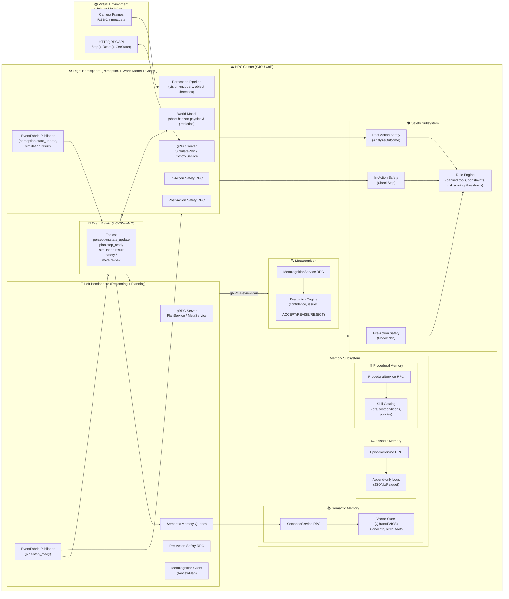

# agi-hpc

TODO: high-level summary.

```mermaid
flowchart LR
    %% ============================================================
    %%  TOP LEVEL SYSTEM
    %% ============================================================
    subgraph HPC_Cluster["🏔️ HPC Cluster (SJSU CoE)"]
    direction LR

        %% ========================================================
        %% Left Hemisphere
        %% ========================================================
        subgraph LH["🧠 Left Hemisphere (Reasoning + Planning)"]
        direction TB
            LH_RPC["gRPC Server\nPlanService / MetaService"]
            LH_MEM["Semantic Memory Queries"]
            LH_SAFETY["Pre-Action Safety RPC"]
            LH_META["Metacognition Client\n(ReviewPlan)"]
            LH_EVENTS["EventFabric Publisher\n(plan.step_ready)"]
        end

        %% ========================================================
        %% Right Hemisphere
        %% ========================================================
        subgraph RH["👁️ Right Hemisphere (Perception + World Model + Control)"]
        direction TB
            RH_RPC["gRPC Server\nSimulatePlan / ControlService"]
            RH_PERCEPTION["Perception Pipeline\n(vision encoders, object detection)"]
            RH_WM["World Model\n(short-horizon physics & prediction)"]
            RH_SAFETY["In-Action Safety RPC"]
            RH_POST["Post-Action Safety RPC"]
            RH_EVENTS["EventFabric Publisher\n(perception.state_update,\n simulation.result)"]
        end

        %% ========================================================
        %% Memory Subsystem
        %% ========================================================
        subgraph MEM["💾 Memory Subsystem"]
        direction TB
            subgraph SEM["📚 Semantic Memory"]
                SEM_RPC["SemanticService RPC"]
                SEM_STORE["Vector Store (Qdrant/FAISS)\nConcepts, skills, facts"]
            end
            subgraph EPI["🎞️ Episodic Memory"]
                EPI_RPC["EpisodicService RPC"]
                EPI_LOG["Append-only Logs\n(JSONL/Parquet)"]
            end
            subgraph PROC["⚙️ Procedural Memory"]
                PROC_RPC["ProceduralService RPC"]
                PROC_SKILLS["Skill Catalog\n(pre/postconditions,\n policies)"]
            end
        end

        %% ========================================================
        %% Safety Subsystem
        %% ========================================================
        subgraph SAFETY["🛡️ Safety Subsystem"]
        direction TB
            PRE["Pre-Action Safety\n(CheckPlan)"]
            INACT["In-Action Safety\n(CheckStep)"]
            POST["Post-Action Safety\n(AnalyzeOutcome)"]
            RULES["Rule Engine\n(banned tools, constraints,\n risk scoring, thresholds)"]
        end

        %% ========================================================
        %% Metacognition
        %% ========================================================
        subgraph META["🔍 Metacognition"]
        direction TB
            META_RPC["MetacognitionService RPC"]
            META_ENGINE["Evaluation Engine\n(confidence, issues,\n ACCEPT/REVISE/REJECT)"]
        end

        %% ========================================================
        %% Event Fabric
        %% ========================================================
        subgraph FABRIC["🔌 Event Fabric (UCX/ZeroMQ)"]
        direction TB
            TOPICS["Topics:\nperception.state_update\nplan.step_ready\nsimulation.result\nsafety.*\nmeta.review"]
        end

    end

    %% ============================================================
    %% External Environment
    %% ============================================================
    subgraph ENV["🌍 Virtual Environment\n(Unity or MuJoCo)\n(runs on laptop)"]
    direction TB
        CAM["Camera Frames\nRGB-D / metadata"]
        STEP_API["HTTP/gRPC API\nStep(), Reset(), GetState()"]
    end

    %% ============================================================
    %%  CONNECTIONS
    %% ============================================================

    %% Environment → RH
    CAM --> RH_PERCEPTION
    STEP_API <--> RH_RPC

    %% Event Fabric links
    RH_EVENTS --> FABRIC
    LH_EVENTS --> FABRIC
    FABRIC --> LH_MEM
    FABRIC --> RH_WM

    FABRIC --> LH
    FABRIC --> RH

    %% LH RPC to memory & safety & meta
    LH_MEM --> SEM_RPC
    LH ---> SAFETY
    LH -- gRPC ReviewPlan --> META

    %% RH RPC to safety
    RH --> INACT
    RH --> POST

    %% Memory internal wiring
    SEM_RPC --> SEM_STORE
    EPI_RPC --> EPI_LOG
    PROC_RPC --> PROC_SKILLS

    %% Safety uses rule engine
    PRE --> RULES
    INACT --> RULES
    POST --> RULES

    META_RPC --> META_ENGINE

    %% LH -> RH plan dispatch
    LH_EVENTS --> RH
```