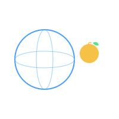
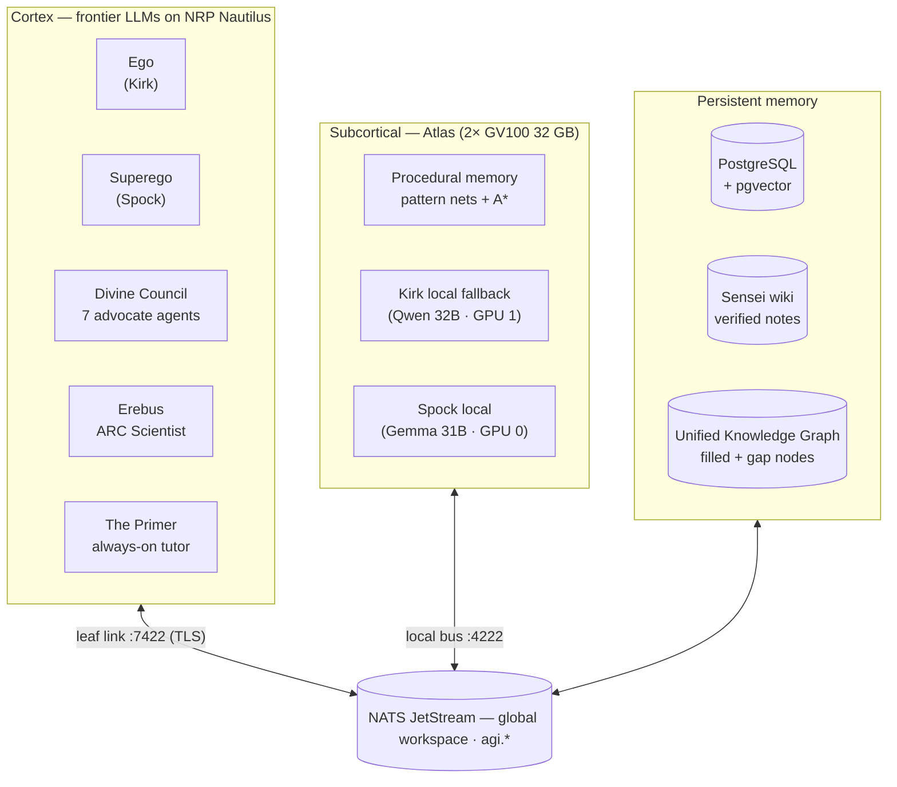
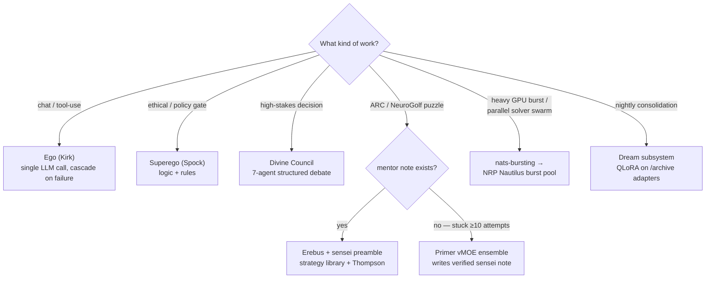
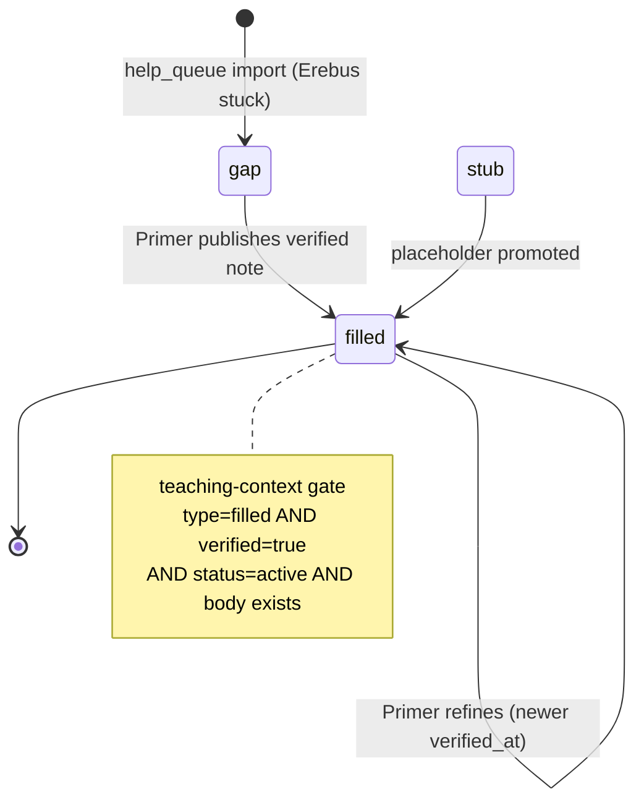
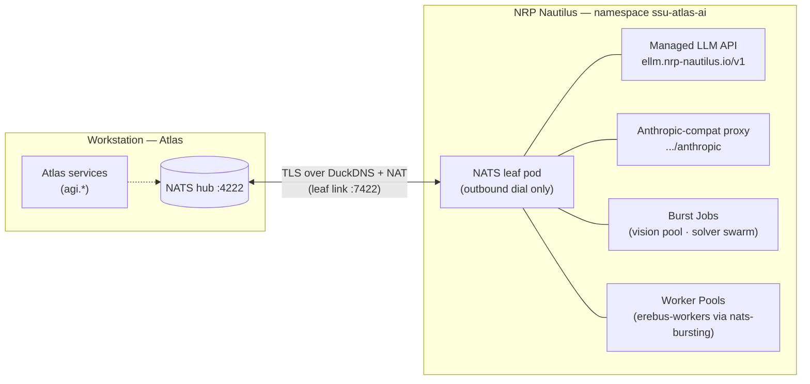

<p align="center">
  <picture>
    <source media="(prefers-color-scheme: dark)" srcset="docs/brand/atlas_mark.svg">
    <source media="(prefers-color-scheme: light)" srcset="docs/brand/atlas_mark_light.svg">
    
  </picture>
</p>

# Atlas AI

### Neuroscience-inspired cognitive architecture with distributed compute


> **Live dashboard:** [atlas-sjsu.duckdns.org/schematic.html](https://atlas-sjsu.duckdns.org/schematic.html) · **Brand assets:** [erisml.org/brand/](https://erisml.org/brand/)

Atlas AI is a **production cognitive architecture** that mirrors the vertebrate brain's cortical / subcortical split. High-level reasoning runs on frontier cloud LLMs (the *cortex*), fast pattern learning and procedural memory run on local GPUs (the *subcortical brain*), and the two tiers are coordinated by NATS JetStream acting as a global workspace (Baars, 1988). Persistent memory lives in PostgreSQL + pgvector.

A Freudian agent model — Ego, Superego, and the Divine Council — negotiates decisions through structured debate. An autonomous learning loop (**Erebus**, the ARC Scientist) improves its own problem-solving strategies over time, and **The Primer** (inspired by Stephenson's *Young Lady's Illustrated Primer*) is an always-on Claude-style tutor that teaches Erebus through verified reference implementations written back to the wiki. A **Unified Knowledge Graph** now tracks both *what has been taught* and *what is still asked-but-unanswered* as first-class nodes, so the teaching loop is observable end-to-end.

## One bus, many shapes

Every subsystem publishes on the same NATS fabric (`agi.*`). Cortex agents, subcortical GPU workers, memory tiers, and remote burst pods are all first-class subscribers — no separate dispatcher, no polling glue.


```mermaid
flowchart TB
  subgraph Cortex["Cortex — frontier LLMs on NRP Nautilus"]
    direction LR
    Ego["Ego<br/>(Kirk)"]
    Super["Superego<br/>(Spock)"]
    Council["Divine Council<br/>7 advocate agents"]
    Sci["Erebus<br/>ARC Scientist"]
    Prim["The Primer<br/>always-on tutor"]
  end
  NATS[("NATS JetStream — global workspace · agi.*")]
  subgraph Sub["Subcortical — Atlas (2× GV100 32 GB)"]
    direction LR
    Proc["Procedural memory<br/>pattern nets + A*"]
    Kirkloc["Kirk local fallback<br/>(Qwen 32B · GPU 1)"]
    Spocloc["Spock local<br/>(Gemma 31B · GPU 0)"]
  end
  subgraph Mem["Persistent memory"]
    direction LR
    PG[("PostgreSQL<br/>+ pgvector")]
    Wiki[("Sensei wiki<br/>verified notes")]
    UKG[("Unified Knowledge Graph<br/>filled + gap nodes")]
  end
  Cortex <-->|"leaf link :7422 (TLS)"| NATS
  Sub <-->|"local bus :4222"| NATS
  Mem <--> NATS
```

## Which subsystem handles what?


```mermaid
flowchart TD
  Q{"What kind of work?"}
  Q -->|"chat / tool-use"| Ego["Ego (Kirk)<br/>single LLM call, cascade on failure"]
  Q -->|"ethical / policy gate"| Super["Superego (Spock)<br/>logic + rules"]
  Q -->|"high-stakes decision"| Council["Divine Council<br/>7-agent structured debate"]
  Q -->|"ARC / NeuroGolf puzzle"| Sci{"mentor note exists?"}
  Sci -->|"yes"| SciLoop["Erebus + sensei preamble<br/>strategy library + Thompson"]
  Sci -->|"no — stuck ≥10 attempts"| Prim["Primer vMOE ensemble<br/>writes verified sensei note"]
  Q -->|"heavy GPU burst /<br/>parallel solver swarm"| Burst["nats-bursting →<br/>NRP Nautilus burst pool"]
  Q -->|"nightly consolidation"| Dream["Dream subsystem<br/>QLoRA on /archive adapters"]
```

## Architecture at a glance

```
                         ╔═══════════════════════════════════════════════════╗
                         ║        CORTEX  —  NRP Nautilus Cloud               ║
                         ║        Frontier LLMs via managed API               ║
                         ╠═══════════════════════════════════════════════════╣
                         ║                                                    ║
                         ║  Ego       Kirk        GLM-4.7 (today) →          ║
                         ║                         GLM-4.5-Air on 4× A10 →   ║
                         ║                         Atlas llama.cpp fallback  ║
                         ║  Superego  Spock       Gemma 4                    ║
                         ║  Council   7 agents    Kimi K2.5 1T               ║
                         ║  Erebus    ARC loop    Kimi / Qwen / GLM rotation ║
                         ║  Primer    vMOE tutor  Kimi + GLM-4.7 + Qwen3 +   ║
                         ║                         MiniMax + Kirk fallback   ║
                         ║                                                    ║
                         ║  + Vision pods (GLM-4.1V on L40 / A10)            ║
                         ║  + Worker pools (nats-bursting on 33-node A10)    ║
                         ╚═══════════════════════╤════════════════════════════╝
                                                 │  NATS leaf :7422 (TLS)
                         ╔═══════════════════════╧════════════════════════════╗
                         ║   GLOBAL WORKSPACE  —  NATS JetStream :4222        ║
                         ║   Subjects: agi.*                                  ║
                         ╚═══════════════════════╤════════════════════════════╝
           ┌─────────────────────────────────────┼─────────────────────────────┐
           │                                     │                             │
  ╔════════╧════════════╗   ╔════════════════════╧════════╗   ╔═══════════════╧═══════╗
  ║ SUBCORTICAL BRAIN    ║   ║ MEMORY  — PostgreSQL +      ║   ║  BRAINSTEM             ║
  ║ 2× Quadro GV100 32GB ║   ║ pgvector · 3.3M PCA-384 vecs║   ║                        ║
  ║                      ║   ║                             ║   ║  Thermal guardian     ║
  ║  Conv training       ║   ║  L0  Dream-consolidated     ║   ║  Watchdog             ║
  ║  Pattern learning    ║   ║  L1  Sensei wiki (Primer +  ║   ║  Telemetry (:8085)    ║
  ║  Procedural memory   ║   ║       human-written)        ║   ║  Caddy proxy + OAuth2 ║
  ║  A* search           ║   ║  L2  PCA-384 IVFFlat        ║   ║  Backup (daily)       ║
  ║  Kirk (local ego     ║   ║  L3  tsvector full-text     ║   ║  atlas-target systemd ║
  ║    fallback)         ║   ║  L4  Episodic memory        ║   ║                        ║
  ║                      ║   ║  L5  Unified Knowledge      ║   ║                        ║
  ║                      ║   ║       Graph (new)           ║   ║                        ║
  ╚══════════════════════╝   ╚═════════════════════════════╝   ╚════════════════════════╝
```

Full systems view: [`docs/ARCHITECTURE_OVERVIEW.md`](docs/ARCHITECTURE_OVERVIEW.md).

## The Freudian agents

Three psychoanalytic agents negotiate decisions through structured debate. The Star Trek analogues show the functional mapping — not the reverse.

| Agent | Role | Primary backend | Current status |
|---|---|---|---|
| **Ego (Kirk)** | Balanced decision-maker — the self that speaks and learns | Managed GLM-4.7 via NRP ellm (today) → self-hosted GLM-4.5-Air AWQ on 4× A10 pod (fine-tuning path) → Atlas llama.cpp fallback → emergency Kimi | Multi-tier cascade; fine-tuning pod gated on NRP capacity |
| **Superego (Spock)** | Logic, rules, ethical evaluation | Gemma 4 31B on local GPU 0, Gemma 4 on NRP | Active |
| **Divine Council** | Multi-perspective deliberation (7 advocate agents: Judge, Advocate, Synthesizer, Ethicist, Historian, Futurist, Pragmatist) | Kimi K2.5 1T on NRP, `atlas-ego.service --parallel 8` CPU backend | Active |

The **Id** role is currently unfilled; the fast-instinct pattern-matching function is served by the basal-ganglia-style local-GPU procedural memory (pattern nets + A*) rather than a dedicated LLM slot.

Fallback path: when NRP is unavailable, Council and Ego fall back to local llama.cpp on the two GV100s.

## Autonomous learning

Erebus attempts ARC tasks continuously; when he gets stuck, he posts to a help queue; The Primer watches the queue, ensembles frontier models, verifies each candidate against `task.train`, and — only if some candidate passes — publishes a `sensei_task_NNN.md` back to the wiki. Erebus reads those notes as mentor preambles on his next attempt.

```mermaid
sequenceDiagram
  autonumber
  participant Sci as Erebus<br/>(ARC Scientist)
  participant Q as Help queue<br/>(erebus_help_queue.json)
  participant Pr as The Primer
  participant MoE as vMOE ensemble<br/>Kimi · GLM-4.7 · Qwen3
  participant Val as Validator<br/>(runs candidate vs task.train)
  participant Wiki as Sensei wiki
  participant UKG as Unified Knowledge Graph

  Sci->>Sci: attempt task 167 (≥10 times, still stuck)
  Sci->>Q: ask_for_help(task=167, error_types)
  Note over Pr: polling tick (default 10 min)
  Pr->>Q: read queue, import as gap nodes
  Pr->>UKG: upsert gap for task 167
  Pr->>MoE: ensemble(context = task + history + wiki)
  MoE-->>Pr: N candidate solutions (parallel)
  loop for each candidate
    Pr->>Val: validate(code, task.train)
  end
  alt any candidate passes all train examples
    Pr->>Wiki: write sensei_task_167.md (frontmatter: verified_by)
    Pr->>Wiki: git commit + push (CI deploys)
    Pr->>UKG: promote gap → filled (created_at preserved)
    Sci->>Wiki: read as mentor preamble next attempt
  else none verify
    Pr->>Pr: cooldown 6h; try again later
  end
```

### Erebus (`src/agi/autonomous/arc_scientist.py`)

Closed-loop scientific reasoning against the NeuroGolf 2026 / ARC-AGI task set:

1. **Observe** — pick an unsolved task (tier-weighted by similarity to prior solves and near-miss exploitation).
2. **Hypothesize** — form a theory via LLM prompt strategy (direct / failure_aware / example_chain / diagnostic).
3. **Experiment** — generate candidate Python `transform(grid)` implementations.
4. **Evaluate** — verify against every training example; any failure = reject.
5. **Learn** — store what worked + what failed with structured error classification (reasoning / execution / perception / specification).
6. **Reflect** — LLM diagnoses *why* a transform failed; result becomes prompt context for the next attempt.
7. **Adapt** — Thompson sampling shifts strategy weights based on evidence.
8. **Mentor preambles** — task-specific sensei notes from the wiki (Primer-generated or human-written) are prepended to relevant prompts.

Live solve count: see [`schematic.html`](https://atlas-sjsu.duckdns.org/schematic.html) (the `Erebus — NeuroGolf 2026` card).

### The Primer (`src/agi/primer/`)

An always-on teaching daemon that meets Erebus at his current confusion and writes verified sensei notes. Details in [`docs/THE_PRIMER.md`](docs/THE_PRIMER.md).

- **Watches** the help queue for tasks where Erebus has ≥ 10 attempts and no solve.
- **Reads** task JSON + attempt history + relevant wiki articles to assemble context.
- **Calls** a **vMOE ensemble** — Kimi, GLM-4.7, Qwen3, MiniMax-M2 on NRP, Kirk-local as resilience fallback. See [`docs/VMOE.md`](docs/VMOE.md).
- **Verifies** each candidate's `transform()` against every training example. Only verified code is published — a wrong mentor note is worse than no note.
- **Publishes** a `sensei_task_NNN.md` to the wiki, git-commits and pushes; CI deploys.
- **Tracks expert health** with a rolling window — a persistently slow or erroring model is skipped for a cooldown so we don't burn tokens on foregone conclusions.
- **Emits one JSONL event per expert response** (`primer_events.jsonl`) so the dashboard can show per-expert calls, verify pass/fail rate, and a latency histogram — signal survives daemon restarts.

Runs as `atlas-primer.service`.

## Unified Knowledge Graph

A single append-only JSONL (`/archive/neurogolf/knowledge_graph.jsonl`) where **filled** sensei notes and **gap** open-questions are both first-class nodes. The dreaming and curiosity subsystems will traverse one graph rather than two separate stores.


```mermaid
stateDiagram-v2
  [*] --> gap: help_queue import (Erebus stuck)
  gap --> filled: Primer publishes verified note
  stub --> filled: placeholder promoted
  filled --> filled: Primer refines (newer verified_at)
  filled --> [*]
  note right of filled
    teaching-context gate
    type=filled AND verified=true
    AND status=active AND body exists
  end note
```

Node model (one per line, full-state snapshot):

| Field | Example |
|---|---|
| `id` | `sensei_task_167` |
| `type` | `filled` / `gap` / `stub` |
| `status` | `active` / `archived` |
| `topic` / `topic_key` | `count distinct colors` / `count-distinct-colors` |
| `tags` | `[classification, count-distinct-colors, arc, primer]` |
| `body_ref` | `sensei_task_167.md` (null for gaps) |
| `verified` / `verified_at` | `true` / `1713574800` |
| `source` | `primer` / `help_queue` / `backfill` / `manual` |
| `evidence` | `["help:t167", "primer_task:167"]` (first-seen stable order) |

The trust gate `is_context_eligible(node)` is the single place that decides whether a node is safe to show a generator as truth — `filled ∧ verified ∧ active ∧ body-exists-on-disk`. Everything else (gaps, unverified notes, archived nodes) stays visible to dashboards and future curiosity consumers but is never fed back as teaching context.

Retrieval mode is controlled by `EREBUS_CONTEXT_READER=wiki|graph` (env) so the cutover from wiki-glob to graph-query can be A/B-compared before committing. Default is `wiki` until graph-backed retrieval is validated in practice.

## Infrastructure

| Component | Description |
|---|---|
| **NATS JetStream** | Global workspace at `:4222`. Leaf node at `:7422` bridges to NRP. |
| **PostgreSQL + pgvector** | 3.3 M PCA-384 vectors. 5-tier retrieval (L0–L4) + L5 UKG. |
| **RAG server** | Flask at `:8081` with dual-hemisphere proxy + hybrid search (BM25 + dense + HyDE + RRF). |
| **Telemetry** | At `:8085`. NATS stats, NRP pod metrics, live GPU / VRAM via `kubectl exec nvidia-smi`. Serves `/schematic.html` with a dynamic `ui:<sha> · <mtime>` version stamp. |
| **Caddy** | Reverse proxy + OAuth2. Serves `atlas-sjsu.duckdns.org`. |
| **Thermal guardian** | CPU temp monitoring (82 °C warn, 100 °C critical). |
| **Watchdog** | Health checks + automatic service restart. |
| **Primer daemon** | `atlas-primer.service` — always-on tutor; CPU-only. |

## NRP Nautilus integration


```mermaid
flowchart LR
  subgraph AtlasBox["Workstation — Atlas"]
    direction TB
    A1["Atlas services<br/>(agi.*)"]
    NH[("NATS hub :4222")]
    A1 -.-> NH
  end
  subgraph NRPBox["NRP Nautilus — namespace ssu-atlas-ai"]
    direction TB
    LP["NATS leaf pod<br/>(outbound dial only)"]
    MLLM["Managed LLM API<br/>ellm.nrp-nautilus.io/v1"]
    ANT["Anthropic-compat proxy<br/>.../anthropic"]
    BJ["Burst Jobs<br/>(vision pool · solver swarm)"]
    WP["Worker Pools<br/>(erebus-workers via nats-bursting)"]
    LP --- MLLM
    LP --- ANT
    LP --- BJ
    LP --- WP
  end
  NH <-->|"TLS over DuckDNS + NAT<br/>(leaf link :7422)"| LP
```

- **Managed LLM API** (`https://ellm.nrp-nautilus.io/v1`): Kimi K2.5, Qwen 3.5 397B, GLM-4.7, MiniMax M2.7, Gemma 4 — shared, OpenAI-compatible, zero marginal cost.
- **Anthropic-compatible proxy** (`.../anthropic`) for Claude Code tooling and the Primer.
- **Burst Jobs** — ephemeral K8s Jobs (vision pool 4× L40/L40S/A10, GLM-4.1V; solver swarms for NeuroGolf). See [`deploy/k8s/`](deploy/k8s/).
- **Worker Pools** — persistent K8s Deployments (`erebus-workers`, nats-bursting). See [nats-bursting](https://github.com/ahb-sjsu/nats-bursting).
- **Live monitoring** — dashboard shows pod count, GPU model, VRAM used/total, utilization. Worker pools and burst jobs appear side-by-side in the *NRP Burst Jobs + Worker Pools* card.
- **L40 reservation caveat** — 15 of 17 L40 nodes carry `csu-tide` reservation taints; our namespace defaults to A10 × 8 (33 abundantly-available nodes) for self-hosted pods.

## Safety

Three-layer architecture:

| Layer | Latency | Function |
|---|---|---|
| **Reflex** | < 100 µs | Emergency stops, thermal limits |
| **Tactical** | 10–100 ms | ErisML ethical evaluation, Bond Index |
| **Strategic** | > 100 ms | Policy enforcement, human oversight |

ErisML provides mathematically grounded ethical reasoning with Hohfeldian analysis and SHA-256 hash-chained decision proofs.

## Regression guards (CI/CD)

| Workflow | Trigger | What it checks |
|---|---|---|
| **Atlas AI — CI/CD** (`ci.yaml`) | push to main | Black format, lint, tests, build, auto-deploy to Atlas (git pull + restart telemetry/rag). |
| **Deploy Smoke** (`deploy-smoke.yaml`) | push to main + 30-min cron | Compares live `/api/version` SHA to `main` HEAD. Asserts `NATS Topology`, `NRP Burst Jobs`, `NATS Live`, `Erebus Cognitive Architecture` panels are present on the rendered page. |
| **Dashboard Render** (`dashboard-render.yaml`) | dashboard path changes + 30-min cron | Playwright headless Chromium loads `schematic.html`, asserts topology SVG populates, burst table has rows, version stamp matches `ui:<sha> · <date>T<time>Z`, no console errors. |

These exist because silent dashboard regressions (stale deploy, empty widget, JS error) previously hid under green Python CI. See [`docs/CHANGELOG.md`](docs/CHANGELOG.md) for the post-mortem on the `cp -f`-through-symlink drift that motivated them.

## Project layout

```
agi-hpc/
├── src/agi/
│   ├── autonomous/          # Erebus — ARC Scientist + ONNX scientist
│   ├── primer/              # The Primer — vMOE + validator + events + service
│   ├── knowledge/           # Unified Knowledge Graph (graph, backfill, gaps)
│   ├── core/                # gRPC, NATS/ZMQ/UCX, DHT, LLM providers
│   ├── reasoning/           # Divine Council, debate, NATS service
│   ├── lh/                  # Left hemisphere: planning, metacognition
│   ├── rh/                  # Right hemisphere: perception, world model
│   ├── memory/              # Episodic, semantic, procedural, knowledge
│   ├── safety/              # 3-layer safety, ErisML, privilege gates
│   ├── metacognition/       # Ego monitor, consistency, anomaly
│   ├── dreaming/            # Memory consolidation, QLoRA adapters
│   ├── training/            # Dungeon Master, gym environment, curriculum
│   ├── attention/           # Distractor detection and filtering
│   ├── thermal/             # Thermal management, job queue
│   ├── integration/         # Cross-subsystem orchestration
│   ├── env/                 # Gymnasium-compatible (MuJoCo / Unity)
│   └── meta/                # LLM-based metacognitive reflection
│
├── configs/                 # Service YAML
├── deploy/
│   ├── systemd/             # 20 service units under atlas.target (incl. atlas-primer)
│   └── k8s/                 # NRP pod manifests (erebus-ego PVC, vision burst)
├── proto/                   # Protocol Buffer definitions
├── infra/
│   ├── hpc/                 # Apptainer, Slurm, Docker
│   └── local/atlas-chat/    # Dashboard (schematic.html, erebus.html)
├── scripts/                 # Watchdog, telemetry, ukg_backfill_wiki, ukg_import_help_queue, …
├── tests/
│   ├── unit/                # Python unit tests (primer_*, ukg_*, dashboard_panels, …)
│   └── dashboard/           # Playwright render tests
├── wiki/                    # Sensei notes (Tier-1 RAG) — Primer writes here
├── docs/                    # Architecture, operations, design docs
└── .github/workflows/       # CI/CD pipeline
```

## Hardware

| Resource | Spec |
|---|---|
| **Atlas** | HP Z840, 2× Xeon E5-2690v3 (48 threads), 251 GB RAM |
| **Local GPUs** | 2× Quadro GV100 32GB (Volta, no NVLink — separate CPU sockets) |
| **Storage** | 15 TB at `/archive` |
| **Network** | Tailscale at `100.68.134.21`; public at `atlas-sjsu.duckdns.org` |
| **NRP** | L40 48 GB, L40S 48 GB, A10 24 GB, A40 48 GB across 100+ university nodes (A100/H100 gated behind reservation form) |
| **NRP LLMs** | Kimi K2.5 1T, Qwen 3.5 397B, GLM-4.7 358B, MiniMax M2.7, Gemma 4 (managed, zero marginal cost) |

## Quickstart

```bash
git clone https://github.com/ahb-sjsu/agi-hpc.git
cd agi-hpc
pip install -e ".[dev]"

# Local development (no network)
export AGI_FABRIC_MODE=local
python src/agi/lh/service.py

# Erebus — ARC Scientist (needs NRP token)
export AGI_FABRIC_MODE=nats
export NRP_LLM_TOKEN=<your-token>
python src/agi/autonomous/arc_scientist.py --task-dir /path/to/tasks

# The Primer (CPU-only)
export NRP_LLM_TOKEN=<your-token>
python -m agi.primer.service

# One-shot UKG backfill from the existing wiki
python scripts/ukg_backfill_wiki.py --verbose
```

Production deployment on Atlas: [`docs/ATLAS_OPERATIONS.md`](docs/ATLAS_OPERATIONS.md). Primer-specific: [`docs/THE_PRIMER.md`](docs/THE_PRIMER.md).

## Documentation

| Doc | Topic |
|---|---|
| [`docs/ARCHITECTURE_OVERVIEW.md`](docs/ARCHITECTURE_OVERVIEW.md) | Full systems view: agents, fabric, memory, NRP, CI/CD |
| [`docs/THE_PRIMER.md`](docs/THE_PRIMER.md) | The Primer — design, safety invariants, operation |
| [`docs/VMOE.md`](docs/VMOE.md) | Virtual Mixture-of-Experts — routing policies, health |
| [`docs/ATLAS_OPERATIONS.md`](docs/ATLAS_OPERATIONS.md) | Atlas workstation ops: systemd, thermal, backup |
| [`docs/DEPLOYMENT_RUNBOOK.md`](docs/DEPLOYMENT_RUNBOOK.md) | How to deploy, roll back, and perform common maintenance |
| [`docs/ONCALL_PLAYBOOK.md`](docs/ONCALL_PLAYBOOK.md) | "Something is broken, what do I look at" |
| [`docs/SLOS_AND_KPIS.md`](docs/SLOS_AND_KPIS.md) | Proposed SLOs, research KPIs, error budget policy |
| [`docs/METRICS_INVENTORY.md`](docs/METRICS_INVENTORY.md) | What's measured / logged today, with endpoints and gaps |
| [`docs/METRICS_CONTRIBUTOR_GUIDE.md`](docs/METRICS_CONTRIBUTOR_GUIDE.md) | Conventions for adding metrics, logs, endpoints |
| [`docs/AGI_ROADMAP.md`](docs/AGI_ROADMAP.md) | Phase status, pending work, long-horizon plan |
| [`docs/CHANGELOG.md`](docs/CHANGELOG.md) | Per-date ship log |

## Citation

```bibtex
@software{bond_atlas_ai_2026,
  author = {Bond, Andrew H.},
  title  = {Atlas AI: Neuroscience-inspired cognitive architecture with distributed compute},
  year   = {2026},
  url    = {https://github.com/ahb-sjsu/agi-hpc}
}
```

## License

MIT (c) 2025 Andrew Bond
