# 🧠 AGI-HPC  
### Embodied, safety-aware AGI architecture for High Performance Computing clusters


AGI-HPC is a **modular, distributed, safety-gated cognitive architecture** designed to run on **university-scale HPC clusters** (SJSU CoE HPC) using:

- **Dual-hemisphere cognition** (LH + RH)  
- **Tiered memory subsystem** (semantic, episodic, procedural)  
- **Multi-layer safety system** (pre-action, in-action, post-action)  
- **Virtual embodiment environment** (Unity/MuJoCo)  
- **Event-driven coordination** (UCX/ZeroMQ fabric)  
- **gRPC services** across all components  
- **Apptainer/Singularity containers** for reproducible HPC deployment

This repository provides the **full scaffolding and automation tools** necessary to build, test, and deploy the system incrementally.

---

# 📐 Architecture Overview

Below is a high-level diagram of the full AGI-HPC multi-service system:

```mermaid
%% MUCH MORE READABLE VERSION
flowchart LR
    %% Global styling for better readability
    classDef bigbox fill:#fffde7,stroke:#666,stroke-width:2px,color:#000,rx:6px,ry:6px,font-size:16px;
    classDef header font-size:20px,font-weight:bold;

    %% Top-level
    subgraph HPC_Cluster["🏔️ HPC Cluster (SJSU CoE)"]
    direction LR

        %% Left Hemisphere
        subgraph LH["🧠 Left Hemisphere (Reasoning + Planning)"]
        direction TB
            LH_RPC["gRPC Server<br/>PlanService / MetaService"]
            LH_MEM["Semantic Memory Queries"]
            LH_SAFETY["Pre-Action Safety RPC"]
            LH_META["Metacognition Client<br/>(ReviewPlan)"]
            LH_EVENTS["EventFabric Publisher<br/>(plan.step_ready)"]
        end

        %% Right Hemisphere
        subgraph RH["👁️ Right Hemisphere (Perception + World Model + Control)"]
        direction TB
            RH_RPC["gRPC Server<br/>SimulatePlan / ControlService"]
            RH_PERCEPTION["Perception Pipeline<br/>(vision encoders, object detection)"]
            RH_WM["World Model<br/>(short-horizon physics & prediction)"]
            RH_SAFETY["In-Action Safety RPC"]
            RH_POST["Post-Action Safety RPC"]
            RH_EVENTS["EventFabric Publisher<br/>(perception.state_update,<br/>simulation.result)"]
        end

        %% Memory
        subgraph MEM["💾 Memory Subsystem"]
        direction TB
            subgraph SEM["📚 Semantic Memory"]
                SEM_RPC["SemanticService RPC"]
                SEM_STORE["Vector Store (Qdrant/FAISS)<br/>Concepts, skills, facts"]
            end
            subgraph EPI["🎞️ Episodic Memory"]
                EPI_RPC["EpisodicService RPC"]
                EPI_LOG["Append-only Logs (JSONL/Parquet)"]
            end
            subgraph PROC["⚙️ Procedural Memory"]
                PROC_RPC["ProceduralService RPC"]
                PROC_SKILLS["Skill Catalog<br/>(pre/postconditions, policies)"]
            end
        end

        %% Safety
        subgraph SAFETY["🛡️ Safety Subsystem"]
        direction TB
            PRE["Pre-Action Safety<br/>(CheckPlan)"]
            INACT["In-Action Safety<br/>(CheckStep)"]
            POST["Post-Action Safety<br/>(AnalyzeOutcome)"]
            RULES["Rule Engine<br/>(banned tools, constraints,<br/>risk scoring, thresholds)"]
        end

        %% Metacognition
        subgraph META["🔍 Metacognition"]
        direction TB
            META_RPC["MetacognitionService RPC"]
            META_ENGINE["Evaluation Engine<br/>(confidence, issues,<br/>ACCEPT/REVISE/REJECT)"]
        end

        %% Event Fabric
        subgraph FABRIC["🔌 Event Fabric (UCX/ZeroMQ)"]
        direction TB
            TOPICS["Topics:<br/>perception.state_update<br/>plan.step_ready<br/>simulation.result<br/>safety.*<br/>meta.review"]
        end

    end

    %% External environment
    subgraph ENV["🌍 Virtual Environment<br/>(Unity or MuJoCo)<br/>(runs on laptop)"]
    direction TB
        CAM["Camera Frames<br/>RGB-D / metadata"]
        STEP_API["HTTP/gRPC API<br/>Step(), Reset(), GetState()"]
    end

    %% Connections
    CAM --> RH_PERCEPTION
    STEP_API <--> RH_RPC

    RH_EVENTS --> FABRIC
    LH_EVENTS --> FABRIC

    FABRIC --> LH_MEM
    FABRIC --> RH_WM
    FABRIC --> LH
    FABRIC --> RH

    LH_MEM --> SEM_RPC
    LH ---> SAFETY
    LH -- gRPC ReviewPlan --> META

    RH --> INACT
    RH --> POST

    SEM_RPC --> SEM_STORE
    EPI_RPC --> EPI_LOG
    PROC_RPC --> PROC_SKILLS

    PRE --> RULES
    INACT --> RULES
    POST --> RULES

    META_RPC --> META_ENGINE

    LH_EVENTS --> RH

    %% Apply bigbox style
    class LH_RPC,LH_MEM,LH_SAFETY,LH_META,LH_EVENTS bigbox;
    class RH_RPC,RH_PERCEPTION,RH_WM,RH_SAFETY,RH_POST,RH_EVENTS bigbox;
    class SEM_RPC,SEM_STORE,EPI_RPC,EPI_LOG,PROC_RPC,PROC_SKILLS bigbox;
    class PRE,INACT,POST,RULES bigbox;
    class META_RPC,META_ENGINE bigbox;
    class TOPICS bigbox;
    class CAM,STEP_API bigbox;
```

### Major subsystems

| Subsystem | Responsibilities | Implementation |
|----------|------------------|----------------|
| **Left Hemisphere (LH)** | Planning, reasoning, metacognition pipeline, symbolic tool use | gRPC service + event fabric |
| **Right Hemisphere (RH)** | Perception, world-model simulation, motor control | gRPC service + event fabric |
| **Semantic Memory** | Vector DB for concepts, embeddings, world knowledge | Qdrant/FAISS (placeholder in-memory for now) |
| **Episodic Memory** | Append-only event logs for replay + analysis | JSONL/Parquet logs |
| **Procedural Memory** | Skills, policies, reusable action graphs | In-memory → SQL later |
| **Safety (3-layer)** | Pre-action, in-action, post-action verification | gRPC services + rule engine |
| **Metacognition** | Cross-check plans, confidence estimation, revise/reject loop | gRPC service + trace analyzer |
| **Environment** | Virtual embodiment (Unity/MuJoCo) | WebSocket/gRPC interface |
| **Event Fabric** | Topic-based low-latency message bus | UCX/ZeroMQ stub (pluggable) |

---

# 🧭 Project Layout

```
agi-hpc/
│
├── src/agi/
│   ├── lh/                  # Left Hemisphere service
│   ├── rh/                  # Right Hemisphere service
│   ├── memory/              # Semantic, episodic, procedural memory
│   ├── safety/              # Safety subsystem (pre/in/post + rule engine)
│   ├── meta/                # Metacognition service
│   ├── core/                # RPC, event fabric, config loader
│   ├── proto_gen/           # Auto-generated protobuf stubs
│   └── env_client/          # Unity/MuJoCo environment client
│
├── proto/                   
├── configs/                 
├── infra/
│   ├── hpc/                
│   └── local/              
│
├── docs/                    
├── design/                  
│
├── scripts/       
├── tests/     

└── .github/workflows/ci.yaml
```

---

# ⚡ Quickstart: Local Development

### 1. Clone:
```bash
git clone https://github.com/ahb-sjsu/agi-hpc.git
cd agi-hpc
```

### 2. Install dev environment:
```bash
pip install -e ".[dev]"
pre-commit install
```

### 3. Generate protobuf stubs:
```bash
python generate_protos.py --clean
```

### 4. Run LH/RH locally:
```bash
python src/agi/lh/service.py
python src/agi/rh/service.py
```
### Note
```
Local dev (no network)

export AGI_FABRIC_MODE=local


ZMQ (dev multi-process / small cluster)

export AGI_FABRIC_MODE=zmq
export AGI_FABRIC_PUB_ENDPOINT=tcp://fabric:5556
export AGI_FABRIC_SUB_ENDPOINT=tcp://fabric:5555


UCX (HPC inter-node)

export AGI_FABRIC_MODE=ucx
export AGI_FABRIC_UCX_ENDPOINT=tcp://fabric-node:13337


Then run a UCX broker/server on fabric-node:13337 that:

accepts UCX connections

reads framed messages with the same [len][topic\0json] format

fans them out to all connected peers.
```
---

# 📜 License
MIT © 2025 Andrew Bond
