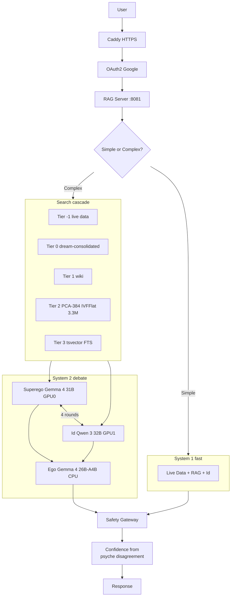

# Atlas AI — AGI-HPC Cognitive Architecture

A local-first, safety-gated cognitive architecture running on consumer hardware.
Built by Andrew H. Bond for the **Gemma 4 Good Hackathon**.
Live at [atlas-sjsu.duckdns.org](https://atlas-sjsu.duckdns.org).

## Architecture



<details>
<summary>Text pipeline (legacy ASCII)</summary>

```
User → Caddy (HTTPS) → OAuth2 (Google Auth) → RAG Server (8081)
  → Query Classification:
      Simple? → System 1: Live Data (Tier -1) + RAG + Id (25.9 tok/s)
      Complex? → System 2: Live Data + RAG + 4-round Superego/Id Debate
  → Search Cascade:
      Tier -1: Live World Data (time, PostGIS geo, system status)
      Tier  0: Dream-consolidated articles (dream-*.md, 1.5x priority)
      Tier  1: Hand-written wiki articles
      Tier  2: PCA-384 IVFFlat vector search (3.3M vectors, 4.4ms)
      Tier  3: tsvector FTS fallback
  → Freudian Psyche Debate (System 2 only):
      GPU 0: Superego (Gemma 4 31B) — analytical, moral, precise
      GPU 1: Id (Qwen 3 32B) — creative, instinctual, intuitive
      CPU:   Ego (Gemma 4 26B-A4B MoE) — mediator, arbiter, dungeon master
  → 4-round debate → Ego synthesizes when disagreement is high
  → Safety Gateway checks output
  → Confidence metric from psyche disagreement
  → Response to user
```

</details>

## Subsystems (13/13 implemented)

| # | Subsystem | Implementation | Port | Status |
|---|-----------|---------------|------|--------|
| 0 | Event Fabric | NATS JetStream | 4222 | Active |
| 1 | Superego (Left Hemisphere) | **Gemma 4 31B** Q5 via llama.cpp, GPU 0 | 8080 | Active |
| 2 | Memory | PostgreSQL + pgvector + SQLite | 50300 | Active |
| 2b | Knowledge Graph | LLM-extracted entities + relationships | — | Active |
| 2c | Research Loop | Autonomous gap detection + research cycles | — | Active |
| 3 | Safety Gateway | ErisML DEME 3-layer pipeline | 50055 | Active |
| 4 | Id (Right Hemisphere) | Qwen 3 32B Q5 via llama.cpp, GPU 1 | 8082 | Active |
| 4b | Ego (Divine Council, 7 agents) | Gemma 4 26B-A4B MoE, 1 server --parallel 8, CPU | 8084 | Active |
| 5 | Metacognition | Monitor + Reflector + Adjuster | — | Active |
| 6 | Environment | System + Repo sensors | — | Active |
| 7 | DHT Registry | Service discovery + config store | — | Active |
| 8 | Integration | Query routing (System 1/2) + debate | 8081 | Active |
| 9 | Dreaming | Memory consolidation → wiki articles + LoRA plasticity | — | Active |
| 10 | Thermal Guardian | Kalman-filtered CPU thermal management | — | Active |
| 11 | Job Queue | Thermal-managed CPU job scheduler | — | Active |
| 12 | LLM Layer | LLMClient + InferenceConfig + Templates | — | Active |

## Performance Benchmarks (HP Z840, Volta GV100)

| Model | GPU | Prompt | Generate | Role |
|-------|-----|--------|----------|------|
| **Gemma 4 31B Q5** | GPU 0 (full offload) | 13.9 tok/s | 2.2 tok/s | Superego — System 2 debate |
| **Qwen 3 32B Q5** | GPU 1 (full offload) | 186.1 tok/s | 25.9 tok/s | Id — System 1 fast path + debate |
| **Gemma 4 26B-A4B MoE** | CPU (10 threads x 4) | ~8 tok/s | ~8 tok/s | Ego — arbiter + dungeon master |

System 1 queries (simple factual) → Id at 25.9 tok/s → **~1.3-3.5s response time**.
System 2 queries (complex/ambiguous) → Superego+Id debate → ~60-120s response time.
High disagreement → Ego arbitrates → adds ~30s for synthesis.

Note: Gemma 4 runs at 2.2 tok/s on Volta GV100 due to architectural differences
(sliding window attention, Gemma-specific ops not optimized for compute 7.0).
Id (Qwen 3) runs at 25.9 tok/s on the same hardware.

## Gemma 4 Good Hackathon

Atlas AI is submitted to the **Gemma 4 Good Hackathon** ($200K total prizes).
Gemma 4 powers two of three psyche components: the Superego (31B, analytical) and the Ego/Council (26B-A4B MoE, mediator/DM).

**Tracks:**
- Main Track ($100K) — Full cognitive architecture with dual-process debate
- Safety & Trust ($10K) — ErisML DEME ethical framework grounded in 3,300 years of moral philosophy
- llama.cpp ($10K) — Gemma 4 31B running on consumer Volta GPU via llama.cpp
- Digital Equity ($10K) — Local-first, no cloud dependency, runs on owned hardware

## Hardware (HP Z840 Workstation)

- CPU: 2x Xeon E5-2690 v3 (48 threads)
- RAM: 256 GB DDR4
- GPU 0: Quadro GV100 32GB (Superego)
- GPU 1: Quadro GV100 32GB (Id)
- Storage: 1.8TB NVMe + 916GB RAID1 + 15TB RAID5
- Location: Bel Marin Keys, Novato, CA

## Knowledge Base

| Dataset | Size | Records |
|---------|------|---------|
| GitHub repos (27) | pgvector | 44K+ chunks |
| Ethics corpora (7 traditions) | pgvector | 102K+ chunks |
| Publications catalog | PostgreSQL FTS | 824K entries |
| Wikipedia | 24 GB | Full English dump |
| Project Gutenberg | Syncing | ~70K books |
| arXiv CS | 1.7 GB | Metadata |
| PostGIS | — | 258 countries + cities |

## Memory Architecture (L1-L5)

| Tier | Medium | Latency | Contents |
|------|--------|---------|----------|
| L1 | VRAM (KV cache) | <1ms | Current conversation |
| L2 | RAM | ~1ms | Hot embeddings, recent sessions |
| L3 | SSD (PostgreSQL) | ~5ms | Episodic, semantic, procedural |
| L4 | HDD (RAID5) | ~50ms | Full repos, old episodes |
| L5 | Network | ~100ms+ | GitHub, web, BitTorrent |

## Retrieval Pipeline

1. **HyDE**: LLM generates hypothetical answer, embed that
2. **BM25**: Full-text search via PostgreSQL tsvector
3. **Dense**: pgvector cosine similarity on BGE-M3 embeddings
4. **RRF**: Reciprocal Rank Fusion merges results
5. **Repo boost**: Named repos get priority
6. **Psyche-aware**: Superego gets precise results, Id gets diverse

## Safety Pipeline (ErisML DEME)

Three-layer firewall on every interaction:
- **Reflex** (<1ms): PII detection, prompt injection, content policy
- **Tactical** (~100ms): MoralVector assessment via Ethics Modules
- **Strategic**: SHA-256 hash-chained decision proofs, audit trail

Ethics grounded in 3,300 years of cross-civilizational moral texts:
Greco-Roman, Jewish, Buddhist, Islamic, Chinese, UN Human Rights, American Advice

## Graduated Privilege System (Kohlberg)

The Ego starts at Level 0 (read-only) and earns higher privileges
through demonstrated competence — mirroring Kohlberg's stages of
moral development and Dreyfus's skill acquisition model.

| Level | Name | Access | Requirements |
|-------|------|--------|-------------|
| L0 | READ_ONLY | Observe all, control nothing | Default |
| L1 | SUGGEST | Propose difficulty changes | Score > 0.7, 50 episodes |
| L2 | ADJUST | Modify own parameters | Score > 0.8, 100 episodes, 0 vetoes |
| L3 | SCHEDULE | Trigger training/dreaming | Score > 0.85 + human approval |
| L4 | ORCHESTRATE | Adjust routing thresholds | Score > 0.9 + human approval |

Safety invariants:
- The Superego (Safety Gateway) can **always veto** any Ego action
- Safety violations trigger **automatic demotion** to L0
- L3+ requires **explicit human approval** (irreversible actions)
- All privilege changes are **audit-logged** to PostgreSQL

## Freudian Psyche Debate

The architecture mirrors Freud's structural model of the mind — built independently
from cognitive science first principles, then recognized as convergent.

Every complex query triggers a 4-round debate:
1. Superego + Id answer in parallel (both GPUs active)
2. Superego challenges Id + Id challenges Superego (parallel)
3. If agreement is high → Id synthesizes (fast path)
4. If disagreement is high → Ego arbitrates (CPU tie-breaker)
5. Confidence measured from psyche disagreement (calibrated ECE)

**Attention Filter (Posner & Petersen, 1990):**
Detects vivid irrelevant sensory/emotional content that could shift model
judgment (proven at 5.0 sigma in the attention benchmark). When distractors
are detected, injects metacognitive warnings into the debate prompts —
recovering ~33% of displaced verdicts. Scores distractor intensity on a
graded scale: none → mild → vivid (matching benchmark dose-response design).

**Divine Council (Minsky, 1986; Mercier & Sperber, 2011; Schank, 1982; Simon, 1955):**
The Ego is not a single mediator but a council of seven specialized sub-agents
sharing a **single llama-server** process with `--parallel 8` on CPU (Gemma 4
26B-A4B MoE, ~18 GB total: ~15 GB model + ~300 MB KV cache per slot):
- **Judge** — Impartial evaluator, scores correctness and logic
- **Advocate** — Devil's advocate, challenges consensus, finds flaws
- **Synthesizer** — Integration expert, merges perspectives into coherent answer
- **Ethicist** — Moral compass, flags bias/harm/fairness concerns
- **Historian** — Precedent tracker, case-based reasoning from prior experience (Schank, 1982)
- **Futurist** — Consequence mapper, second-order effects and long-term impact (Gilbert & Wilson, 2007)
- **Pragmatist** — Feasibility assessor, resource constraints and viability (Simon, 1955)

All seven deliberate simultaneously on every complex query via concurrent HTTP
requests to the shared server. The Advocate always challenges (preventing
groupthink). The Ethicist can veto consensus if ethical concerns arise.
Consensus requires majority approval (4+ of 6 non-advocate members) with no
ethical flags. The single-server architecture uses ~75% less RAM than running
separate instances per member.

**Executive Function (Miyake et al., 2000):**
The prefrontal cortex of the architecture. Before any reasoning begins, the
executive function analyzes the query and decides:
- **Mode selection** (Shifting): simple factual → System 1, analysis → debate, deep ethical → Tree-of-Thought
- **Multi-step decomposition** (Planning): complex multi-part queries are split into
  sub-queries that are answered sequentially — each answer feeds into the next as
  context, then the Ego synthesizes all steps into a coherent response
- **Inhibition control**: ambiguous queries get a clarifying question, not a guess
- **Goal tracking** (Updating): detects multi-turn conversations building toward a
  larger goal; automatically boosts episodic context for continuation queries
- **Context strategy routing**: selects the optimal RAG strategy per query —
  `minimal` (skip RAG for simple factual), `episodic_recent` (recent conversation
  memory for follow-ups), `semantic_deep` (2x results for complex research), or
  `default` (standard wiki + pgvector + FTS)

**Tree-of-Thought + Divine Council (Yao et al., 2023; Minsky, 1986):**
Instead of each hemisphere producing one answer, each generates 3 reasoning branches
using different strategies (logical analysis, rules/precedent, evidence-based for the
Superego; gut feeling, creative analogy, human impact for the Id). The **Divine Council**
evaluates all 6 branches through 7-agent deliberation:
- The **Judge** scores each branch for accuracy, depth, and usefulness
- The **Advocate** challenges weak reasoning and penalizes unsupported claims
- The **Ethicist** reviews branches for bias, harm, and fairness concerns
- The **Historian** checks branches against prior decisions and known failure modes
- The **Futurist** traces second-order consequences and flags irreversible commitments
- The **Pragmatist** assesses feasibility and resource requirements
- The **Synthesizer** produces the final answer from the strongest branches

This replaces the single-Ego evaluation with adversarial multi-agent review,
producing measurably better answers on complex questions while catching
reasoning errors that a single evaluator would miss.

**Daily Training (Ego as Dungeon Master):**
The Ego generates training scenarios from three sources: (1) ErisML Greek Tragedy
Pantheon cases (structured ethical dilemmas across 8 moral domains), (2) LLM-generated
novel scenarios, and (3) **retrospective replay** of real user conversations —
"what should we have done differently?" A **knowledge gap detector** analyzes recent
episodes for weak topics and biases training toward detected gaps. After training,
a dreaming "nap" consolidates lessons into wiki articles and runs LoRA fine-tuning
(synaptic plasticity) on high-certainty knowledge. The wiki is the AGI's growing
life story.

## TurboQuant KV Cache Compression

Adapted from Theory Radar's TurboBeam implementation, which uses the
Zandieh et al. (ICLR 2026) PolarQuant + QJL algorithm for sub-linear
memory inference.

**Algorithm**: Random rotation (QR) maps each head-dim vector onto the
unit hypersphere, then an optimal Lloyd-Max scalar quantizer compresses
each coordinate to b bits (2, 3, or 4).  Only uint8 indices and a
per-vector L2 norm are stored.

**Memory savings (Gemma 4 27B, fp16 baseline)**:

Current (uint8 storage, ~2x):

| Context | Bits | Original | Compressed | Ratio | Saved |
|---------|------|----------|------------|-------|-------|
| 8,192   | 3    | 4.500 GB | 2.285 GB  | 1.97x | 2.215 GB |
| 16,384  | 3    | 9.000 GB | 4.570 GB  | 1.97x | 4.430 GB |
| 32,768  | 3    | 18.00 GB | 9.141 GB  | 1.97x | 8.859 GB |

With bit-packing (future optimisation, ~5x):

| Context | Bits | Original | Compressed | Ratio | Saved |
|---------|------|----------|------------|-------|-------|
| 8,192   | 3    | 4.500 GB | 0.879 GB  | 5.12x | 3.621 GB |
| 16,384  | 3    | 9.000 GB | 1.758 GB  | 5.12x | 7.242 GB |
| 32,768  | 3    | 18.00 GB | 3.516 GB  | 5.12x | 14.48 GB |

Source: `src/agi/meta/llm/turboquant_kv.py`
Benchmark: `scripts/benchmark_turboquant_kv.py`
Tests: `tests/unit/test_turboquant_kv.py`

### llama.cpp Integration Options

**Option A: Python KV cache wrapper (recommended for prototyping)**
Wrap `llama-server` with a Python process that intercepts KV cache
tensors between layers.  On each forward pass, compress old KV entries
(beyond a sliding window) using `TurboQuantKV.compress()`, freeing VRAM.
Decompress on-demand when attention reaches those positions.  This
requires exposing KV cache tensors via the llama.cpp Python bindings
(`llama-cpp-python`), which supports `kv_cache_view()`.

**Option B: Custom CUDA kernel linked into llama.cpp**
Write a CUDA kernel that performs the rotation + quantization in-place
within the llama.cpp KV cache management code (`llama-kv-cache.cpp`).
This avoids Python overhead and integrates directly with the inference
loop.  Requires modifying `ggml-cuda` to add the quantization as a new
operation type.  Highest performance but most engineering effort.

**Option C: External cache manager (eviction-based)**
Run `TurboQuantKV` as a sidecar process that manages a compressed L2
cache on host RAM.  When VRAM KV cache is full, evict oldest entries
to the compressed store.  On cache miss, decompress and reload into
VRAM.  This is a form of memory tiering (L1: VRAM, L2: compressed RAM)
that fits the existing AGI-HPC memory architecture (see Memory Tiers).

For the Gemma 4 Good Hackathon, Option A is the fastest path to a
working demo.  Option C aligns best with the AGI-HPC L1-L5 memory
hierarchy.

## Training & Self-Improvement

- **DM Training**: Ego generates scenarios from 3 sources:
  - ErisML Greek Tragedy Pantheon (8-domain structured ethics)
  - LLM-generated novel dilemmas
  - Retrospective replay of real user conversations
- **Knowledge Gap Detection**: Curriculum planner analyzes episodes
  for low quality, safety flags, short responses, and high disagreement.
  Automatically biases next training session toward weak domains.
- **Curriculum**: Auto-promotes at >80%, demotes at <40%
- **Synaptic Plasticity**: Dreaming extracts instruction pairs from
  high-certainty wiki articles and runs LoRA fine-tuning on the Ego
- **Daily Cycle**: 10AM training, 12PM nap, 2AM dream, 4AM backup
- **Benchmark**: 100-question validation across 5 categories
  (factual, reasoning, ethics, creative, code)

## Web UI

- Chat: atlas-sjsu.duckdns.org
- Dashboard: /schematic.html (GPU gauges, job monitor, training metrics)
- Events: /events.html (NATS activity, subsystem events)
- Mobile responsive, Google OAuth

## Quick Start

```bash
# Install systemd services (first time)
sudo bash deploy/systemd/install-services.sh

# Check all services
sudo systemctl status atlas-*

# Restart a service
sudo systemctl restart atlas-superego

# Follow logs
sudo journalctl -u atlas-ego -f

# Run DM training (retrospective + ErisML + LLM scenarios)
python -m agi.training.dungeon_master --episodes 20 --retrospective

# Start via tmux (legacy fallback)
bash scripts/start_atlas.sh
```

## Documentation

| Document | Contents |
|----------|----------|
| [atlas-agi-hpc-implementation-plan.md](atlas-agi-hpc-implementation-plan.md) | Full implementation plan (Phases 0-7) |
| [phase7-metacognitive-loop.md](phase7-metacognitive-loop.md) | Metacognitive self-improvement roadmap |
| [ARCHITECTURE_OVERVIEW.md](ARCHITECTURE_OVERVIEW.md) | Original AGI-HPC architecture |
| [MASTER_IMPLEMENTATION_PLAN.md](MASTER_IMPLEMENTATION_PLAN.md) | Sprint-based development plan |

## Competition

Entered in **Gemma 4 Good Hackathon** (Kaggle, deadline May 18 2026):
- Main Track ($50K), Safety & Trust ($10K), llama.cpp ($10K), Unsloth ($10K)
- Live demo, video, writeup, code repo

## License

AGI-HPC Responsible AI License v1.0
