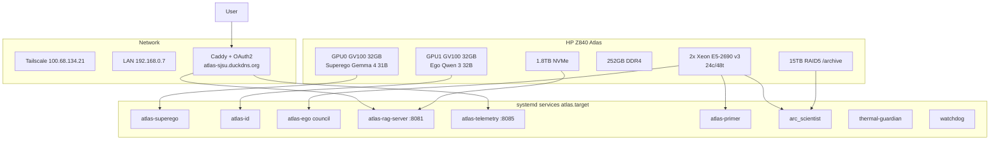

# Atlas AI — Complete Operations & Architecture Guide

**Author:** Andrew H. Bond
**Last Updated:** 2026-04-04
**Status:** Production (systemd-managed services)
**URL:** https://atlas-sjsu.duckdns.org

---

## 1. Hardware

### HP Z840 Workstation ("Atlas")

| Component | Specification |
|-----------|--------------|
| CPU | 2x Intel Xeon E5-2690 v3 (24 cores / 48 threads, 2.60 GHz) |
| RAM | 252 GB DDR4 (mixed DIMMs) |
| GPU 0 | NVIDIA Quadro GV100 32 GB HBM2 (Volta, compute 7.0, bus 04:00.0, CPU 0) |
| GPU 1 | NVIDIA Quadro GV100 32 GB HBM2 (Volta, compute 7.0, bus 84:00.0, CPU 1) |
| NVLink | Not possible (one x16 root port per CPU) |
| SSD | 1.8 TB NVMe (48% used) |
| Archive | 15 TB RAID5 (/archive, 2% used) |
| Network | Tailscale VPN (100.68.134.21), LAN 192.168.0.7 |
| Location | Bel Marin Keys, Novato, CA |

### Thermal Limits

- CPU package: crit at 100°C, cap joblib workers at 20 (40 causes 99°C)
- GPU 0 (Spock): typically 57°C idle, 80°C under load
- GPU 1 (Kirk/embed): typically 78-83°C under load

### Software Stack

| Component | Version |
|-----------|---------|
| OS | Ubuntu 24.04.2 LTS (kernel 6.8.0-106) |
| NVIDIA Driver | 570.211.01 |
| CUDA | 12.8 |
| Python | 3.12.3 (venv at /home/claude/env) |
| PyTorch | 2.10.0+cu128 |
| PostgreSQL | 16 with pgvector 0.6.0 |
| NATS | v2.10.24 (JetStream enabled) |
| llama.cpp | Latest (built from source) |
| Caddy | v2.x (HTTPS + TLS via Let's Encrypt) |
| CuPy | cu128 (for CUDA RawKernels) |

---

## 2. Architecture



### 2.1 Cognitive Architecture Overview

Atlas implements a 10-subsystem cognitive architecture inspired by dual-process theory (Kahneman, 2011), Global Workspace Theory (Baars, 1988), and biologically-inspired memory hierarchies.

```
                        ┌─────────────────────────┐
                        │   Web UI (atlas-chat)    │
                        └───────────┬─────────────┘
                                    │ HTTPS
                        ┌───────────▼─────────────┐
                        │  Caddy (TLS + Reverse)   │ :443
                        └───────────┬─────────────┘
                        ┌───────────▼─────────────┐
                        │  OAuth2 Proxy (Google)   │ :4180
                        └───────────┬─────────────┘
                        ┌───────────▼─────────────┐
                        │    RAG Server (Flask)    │ :8081
                        │  Wiki → PCA-384 → FTS   │
                        └──────┬──────────┬───────┘
                 ┌─────────────▼──┐  ┌────▼──────────────┐
                 │ Spock (GPU 0)  │  │  Kirk (GPU 1)     │
                 │ Qwen 72B Q5   │  │  (when available)  │
                 │ :8080          │  │  :8082             │
                 └────────────────┘  └───────────────────┘
                               │
               ┌───────────────▼────────────────┐
               │      NATS JetStream :4222       │
               │  Event Fabric (agi.* subjects)  │
               └──┬────┬────┬────┬────┬────┬────┘
                  │    │    │    │    │    │
               Memory Safety Meta DHT  Env  Integration
               :50300 :50055       ...
```

### 2.2 Dual-Hemisphere Design

Based on Iain McGilchrist's "The Master and His Emissary" (2009) and dual-process theory:

- **Left Hemisphere (Spock)**: Analytical, precise, citation-heavy. Gemma 4 or Qwen 72B.
  Excels at code analysis, formal reasoning, factual Q&A.
- **Right Hemisphere (Kirk)**: Creative, pattern-matching, divergent. Qwen 32B.
  Excels at brainstorming, cross-domain connections, narrative.
- **Debate Protocol**: 4-round structured debate with parallel evaluation,
  inspired by "Debate" (Irving et al., 2018) and "Constitutional AI" (Bai et al., 2022).
- **Confidence Metric**: Hemisphere disagreement measured via embedding cosine
  distance, calibrated via Platt scaling.

### 2.3 Memory Hierarchy

Inspired by Atkinson-Shiffrin (1968) multi-store model and Tulving's (1972)
memory taxonomy:

| Tier | Medium | Latency | Contents | Compression |
|------|--------|---------|----------|-------------|
| L1 | VRAM (KV cache) | <1 ms | Current conversation | fp16 (q8_0 available) |
| L2 | RAM | ~1 ms | Hot embeddings, recent sessions | TQ3 optional |
| L3 | SSD (PostgreSQL) | ~5 ms | Semantic + episodic + procedural | PCA-384 + IVFFlat |
| L4 | HDD (RAID5) | ~50 ms | Full repos, archives | PCA-384 + TQ3 (27.7x) |
| L5 | Network | ~100 ms+ | GitHub, web, BitTorrent | NATS codec (89.5x) |

**Memory types** (Tulving, 1972):
- **Semantic**: Factual knowledge, RAG chunks. pgvector with BGE-M3 1024-dim.
- **Episodic**: Conversation history. Timestamped episodes with embeddings.
- **Procedural**: Learned operations. SQLite with trigger-pattern matching.

### 2.4 Safety Architecture (ErisML DEME)

Three-layer ethical firewall based on the DEME (Distributed Ethical Moral Engine)
framework, grounded in cross-civilizational moral philosophy:

| Layer | Latency | Function | Theoretical Basis |
|-------|---------|----------|-------------------|
| Reflex | <1 ms | PII detection, prompt injection, content policy | Kahneman System 1 |
| Tactical | ~100 ms | MoralVector assessment via Ethics Modules | Virtue ethics (Aristotle), Deontology (Kant) |
| Strategic | ~1 s | SHA-256 hash-chained decision proofs, audit trail | Consequentialism (Mill), Social contract (Rawls) |

Ethics corpus: 2.4M passages from 9 traditions spanning 3,300+ years:
Confucian, Buddhist, Hindu, Islamic, Christian, Jewish, Greco-Roman, African, Indigenous.

### 2.5 Search Architecture (Benchmark-Proven)

Three-tier cascade validated by empirical benchmarks (50 queries, 112K chunks):

| Tier | Method | Recall@10 | Latency | When Used |
|------|--------|-----------|---------|-----------|
| 1 | Wiki article lookup | — | <1 ms | Structural "how does X work?" queries |
| **2** | **PCA-384 IVFFlat** | **0.906** | **4.4 ms** | **Primary search (all queries)** |
| 3 | tsvector FTS | 0.102 | 2.9 ms | Keyword fallback (vector returns 0) |

**Methods tested but NOT deployed** (benchmarks showed inferior results):

| Method | Recall@10 | Latency | Why Not |
|--------|-----------|---------|---------|
| Full 1024-dim exact | 1.000 | 457 ms | 104x slower than PCA-384 |
| GPU Hamming funnel | 0.908 | 10.8 ms | Same recall, 2.5x slower at 112K |
| Hybrid RRF (vector+FTS) | 0.852 | 14.9 ms | FTS noise dilutes vector results |

**Key finding**: RRF fusion of vector + FTS HURTS recall. FTS is useful only
as a standalone keyword fallback, not as a fusion source.

**References:**
- PCA-Matryoshka: Bond (IEEE TAI, 2026)
- TurboQuant: Zandieh, Han, Daliri, Karbasi (ICLR, 2026)
- Reciprocal Rank Fusion: Cormack, Clarke, Butt (SIGIR, 2009)
- BGE-M3: Xiao et al. (ACL Findings, 2024)
- IVFFlat: Jégou, Douze, Schmid (IEEE TPAMI, 2011)

### 2.6 Compression Pipeline (PCA-Matryoshka + TurboQuant)

**Theory**: PCA rotation reorders embedding dimensions by explained variance,
enabling effective truncation for models not trained with Matryoshka losses
(Kusupati et al., NeurIPS 2022). Combined with Lloyd-Max scalar quantization
on the rotated hypersphere (Zandieh et al., ICLR 2026).

**Pipeline**: Embed → Center → PCA Rotate → Truncate (384 dims) → Quantize (3-bit) → Bit-pack

| Method | Cosine | Bytes/vec | Ratio | Index Size |
|--------|--------|-----------|-------|------------|
| Full 1024 float32 | 1.000 | 4,096 B | 1.0x | 24 GB (ethics) |
| PCA-384 float32 | 0.984 | 1,536 B | 2.7x | 3.7 GB |
| TQ3 1024-dim | 0.978 | 388 B | 10.6x | — |
| PCA-384 + TQ3 | 0.971 | 148 B | 27.7x | — |
| Binary PCA-384 | — | 48 B | 85x | 5.25 MB |
| NATS JSON payload | — | 254 B | 89.5x | — |

**KV cache compression (Volta limitation)**:
q8_0 KV saves 47% memory but incurs 1.9x throughput penalty on Volta (no hw int8).
fp16 retained for production. Enable `--cache-type-k q8_0 --cache-type-v q8_0`
on Ampere+ GPUs.

### 2.7 Wiki Compilation (Karpathy Pattern)

Inspired by Andrej Karpathy's "LLM Knowledge Bases" approach:
- Spock (Gemma 4) reads source code and writes structured markdown articles
- Articles have backlinks, summaries, and key concept indexes
- Wiki is Tier 1 in search cascade (instant lookup, no embedding needed)
- Self-healing: periodic lint passes detect stale/inconsistent articles
- Location: `/home/claude/agi-hpc/wiki/`

### 2.8 Models & Personas

#### Spock (Left Hemisphere — GPU 0)

| Property | Value |
|----------|-------|
| **Persona** | Analytical, precise, citation-heavy. Named after the Vulcan science officer. |
| **Role** | Primary reasoning engine. Handles factual Q&A, code analysis, formal logic. |
| **Current Model** | Qwen2.5-72B-Instruct-Q5_K_M (GGUF, 5-bit quantized) |
| **VRAM** | ~31 GB on GPU 0 |
| **Context** | 8,192 tokens (14,336 with q8_0 KV cache, at 2x speed penalty) |
| **Throughput** | ~4.2 tok/s (fp16 KV), ~2.2 tok/s (q8_0 KV) |
| **Port** | 8080 |
| **System prompt** | "You are Atlas... the Left Hemisphere — analytical, precise, and citation-heavy." |

**Model history**: Originally Gemma 4 31B-IT Q5_K_M. Upgraded to Qwen2.5-72B for
superior instruction following and reasoning. The `start_atlas.sh` script references
both; the systemd service uses whichever GGUF is in the models directory.

#### Kirk (Right Hemisphere — GPU 1)

| Property | Value |
|----------|-------|
| **Persona** | Creative, intuitive, pattern-matching. Named after the Enterprise captain. |
| **Role** | Divergent thinking. Brainstorming, cross-domain analogy, narrative synthesis. |
| **Planned Model** | Qwen3-32B-Q5_K_M or equivalent creative model |
| **VRAM** | ~31 GB on GPU 1 (when not running embedding jobs) |
| **Context** | 8,192 tokens |
| **Port** | 8082 |
| **System prompt** | "You are Atlas... the Right Hemisphere — creative, intuitive, pattern-seeking." |

**Status**: Kirk is typically offline because GPU 1 is used for embedding jobs
(BGE-M3 for ethics corpus, publications). When both hemispheres are active,
the RAG server orchestrates a 4-round debate protocol.

#### Debate Protocol

When both Spock and Kirk are active:

1. **Opening** (parallel): Both receive the query + RAG context independently
2. **Challenge** (parallel): Each reads the other's response and critiques it
3. **Synthesis**: Kirk integrates both perspectives as "captain's decision"
4. **Confidence**: Measured from cosine distance between Spock/Kirk embeddings

The debate is inspired by Irving et al.'s "AI Safety via Debate" (2018),
where adversarial questioning surfaces errors that a single model might miss.

#### Embedding Model

| Property | Value |
|----------|-------|
| **Model** | BAAI/bge-m3 (via sentence-transformers) |
| **Dimension** | 1024 (full), 384 (PCA-projected) |
| **Device** | CPU (in RAG server), GPU 1 (for batch embedding) |
| **Normalization** | L2-normalized for cosine similarity |
| **PCA basis** | Fitted on 10K chunk embeddings, 94.8% variance at 384 dims |

#### Available Models on Atlas

| Model | Size | Quant | Location | Use |
|-------|------|-------|----------|-----|
| Qwen2.5-72B-Instruct | 45 GB | Q5_K_M | /home/claude/models/ | Spock (primary) |
| Qwen2.5-32B-Instruct | 22 GB | Q4_K_M | /home/claude/models/ | Spock (fallback) |
| Qwen3-32B | 22 GB | Q5_K_M | /home/claude/models/ | Kirk |
| Gemma 4 31B-IT | 21 GB | Q5_K_M | /home/claude/models/ | Spock (original) |
| BAAI/bge-m3 | 2.5 GB | fp32 | HuggingFace cache | Embedding |

#### Persona Guidelines

**Spock responses should**:
- Lead with the factual answer, then explain reasoning
- Cite specific files, functions, or papers when referencing local knowledge
- Use structured formatting (headers, bullet points, tables)
- Flag uncertainty explicitly ("I don't have data on X")

**Kirk responses should**:
- Start with the big-picture insight or analogy
- Draw connections across different domains
- Suggest creative alternatives the user may not have considered
- Use narrative structure (story, metaphor)

**Debate synthesis should**:
- Acknowledge where Spock and Kirk agree (convergent evidence)
- Highlight where they disagree and why
- Give the user actionable next steps
- Report confidence level (high/medium/low based on disagreement metric)

---

## 3. Services

### 3.1 systemd Services

All critical services are managed by systemd with auto-restart and boot persistence.

| Service | Unit | Port | Process |
|---------|------|------|---------|
| Caddy | atlas-caddy | 443, 80 | HTTPS reverse proxy + TLS |
| OAuth2 Proxy | atlas-oauth2-proxy | 4180 | Google authentication |
| RAG Server | atlas-rag-server | 8081 | Search + hemisphere routing |
| Spock LLM | atlas-llm-spock | 8080 | Qwen 72B Q5_K_M on GPU 0 |
| Telemetry | atlas-telemetry | 8085 | System metrics + event stream |
| NATS | atlas-nats | 4222, 7422, 8222 | JetStream hub + leaf listener ([§3.5](#35-nats-bursting-k8s-cloud-bursting)) |
| NATS cert sync | sync-nats-cert.path | — | Path unit: reloads NATS on Caddy cert rotation |
| Burst controller | nats-bursting | — | [`nats-bursting`](https://github.com/ahb-sjsu/nats-bursting) NATS→K8s dispatcher |

```bash
# Check all services
sudo systemctl status atlas-*

# Restart a service
sudo systemctl restart atlas-rag-server

# Follow logs
sudo journalctl -u atlas-rag-server -f

# Disable auto-start
sudo systemctl disable atlas-llm-spock

# Install/uninstall all
sudo bash deploy/systemd/install-services.sh
sudo bash deploy/systemd/install-services.sh --uninstall
```

### 3.2 Non-systemd Services (manual/tmux)

| Service | Port | How to Start |
|---------|------|-------------|
| Research Portal | 8443 | Runs independently |
| Kirk LLM (GPU 1) | 8082 | Via start_atlas.sh when GPU 1 free |
| Memory NATS Service | 50300 | `python -m agi.memory.nats_service` |
| Safety NATS Service | 50055 | `python -m agi.safety.nats_service` |
| Metacognition | — | `python -m agi.metacognition.nats_service` |

> **Note:** NATS was moved under systemd as `atlas-nats.service` (2026-04-16) when the leaf-node listener for NRP bursting was added. The process still runs as `/home/claude/bin/nats-server` but is now config-driven (`/home/claude/nats.conf`) and starts at boot. See [§3.5](#35-nats-bursting-k8s-cloud-bursting).

### 3.3 Request Flow

```
Browser → Caddy (:443, TLS)
  → OAuth2 Proxy (:4180, Google Auth)
    → RAG Server (:8081)
      → Wiki lookup (filesystem, <1ms)
      → PCA-384 IVFFlat search (pgvector, 4.4ms)
      → FTS fallback (tsvector, 2.9ms)
      → Embed query (BGE-M3, 232ms)
      → Inject context into prompt
      → Forward to Spock (:8080) or Kirk (:8082)
      → 4-round debate (if both hemispheres active)
      → Safety check
      → Stream response to client

Telemetry: Caddy routes /api/telemetry, /api/events, /api/visitors
  directly to Telemetry Server (:8085), bypassing OAuth2.
```

### 3.5 nats-bursting (K8s cloud bursting)

Atlas bursts training jobs and long-tail inference to **NRP Nautilus**
via [`nats-bursting`](https://github.com/ahb-sjsu/nats-bursting). The
remote cluster participates in the local `agi.*` NATS fabric as a
first-class leaf node — burst pods subscribe to the same subjects as
local services.

**NRP namespace:** `ssu-atlas-ai` (SSU allocation under NRP federation).
**NRP API:** `https://67.58.53.148:443` (OIDC via
`authentik.nrp-nautilus.io`).

#### Topology

```
      ┌──────────────── Atlas ────────────────┐             ┌──── NRP (ssu-atlas-ai) ────┐
      │                                       │             │                            │
      │  agi.* subsystems ─► NATS :4222 (hub) │             │  Burst pods                │
      │                         ▲             │             │   ↕                        │
      │                         │             │             │  atlas-nats leaf service   │
      │                         │             │             │   ↕                        │
      │                  :7422 leaf listener ◄─── TLS ──────┤  NATS leaf pod (Deployment)│
      │                  (TLS via Caddy cert) │  outbound   │                            │
      │                         ▲             │  only       │                            │
      │  nats-bursting ─────────┘             │             │                            │
      │  (Go controller, systemd)             │             │                            │
      └───────────────────────────────────────┘             └────────────────────────────┘

             Router NAT: 0.0.0.0:7422 → 192.168.0.7:7422
                   Public hostname: atlas-sjsu.duckdns.org
```

#### Key files on Atlas

| Path | Role |
|------|------|
| `/usr/local/bin/nats-bursting` | Go controller binary |
| `/etc/nats-bursting/config.yaml` | Controller config (user/group `claude`, mode `0640`) |
| `/etc/systemd/system/nats-bursting.service` | Systemd unit (`Requires=atlas-nats.service`) |
| `/home/claude/nats.conf` | NATS config with `leafnodes {}` block on :7422 |
| `/etc/nats/certs/atlas.{crt,key}` | Caddy-managed Let's Encrypt cert, synced for nats-server |
| `/usr/local/bin/sync-nats-cert.sh` | Cert sync + HUP helper |
| `/etc/systemd/system/sync-nats-cert.path` | Path unit watching Caddy cert for rotation |
| `/home/claude/.kube/config` | NRP kubeconfig (OIDC, refresh tokens in `~/.kube/cache/oidc-login/`) |

#### Submitting a job

From any Python script on Atlas or any machine that can reach NATS:

```python
from nats_bursting import Client, JobDescriptor, Resources

client = Client(nats_url="nats://localhost:4222")
result = client.submit_and_wait(
    JobDescriptor(
        name="hello",
        image="python:3.12-slim",
        command=["python", "-c", "print('hello from NRP')"],
        resources=Resources(cpu="100m", memory="128Mi"),
    ),
    timeout=60,
)
```

From a Jupyter notebook:

```python
%load_ext nats_bursting.magic
%%burst --gpu 1 --memory 24Gi
import torch
model = load_qwen_72b()
```

The `%%burst` magic probes `nvidia-smi` and only bursts if every local
GPU is saturated. `--always` / `--never` override the check.

#### Politeness defaults

Tuned conservatively for NRP's shared-cluster policy (400-pod
namespace cap, soft social contract against flooding):

| Threshold | Value |
|---|---|
| `max_concurrent_jobs` | 10 |
| `max_pending_jobs` | 5 |
| `queue_depth_threshold` | 100 cluster-wide pending pods |
| `utilization_threshold` | 0.85 |
| `initial_backoff` | 30 s → `max_backoff` 15 min |
| `backoff_multiplier` | 2.0 |
| `max_attempts` | 15 |

Override in `/etc/nats-bursting/config.yaml`.

#### Common ops

```bash
# Controller state
systemctl status nats-bursting
sudo journalctl -u nats-bursting -f

# NATS hub state (leaf connections, JetStream)
curl -s http://localhost:8222/leafz   | jq .
curl -s http://localhost:8222/jsz     | jq .

# Restart hub (leaf listener TLS will re-init; NRP leaf auto-reconnects)
sudo systemctl restart atlas-nats

# Remote: see the bridge pod
KUBECONFIG=~/.kube/config kubectl -n ssu-atlas-ai \
  logs deploy/atlas-nats-leaf -f

# Submit a test job from Atlas
nats --server nats://localhost:4222 pub burst.submit \
  '{"job_id":"test","descriptor":{"name":"ping","image":"alpine","command":["echo","hi"]}}'
```

#### Cert rotation

Caddy rotates the `atlas-sjsu.duckdns.org` Let's Encrypt cert ~30 days
before expiry. The `sync-nats-cert.path` systemd unit watches Caddy's
storage dir and triggers the sync+HUP on change — no manual action
needed, but if something's off:

```bash
sudo systemctl status sync-nats-cert.path
sudo /usr/local/bin/sync-nats-cert.sh      # force sync
```

---

## 4. Database

### 4.1 PostgreSQL Tables

| Table | Rows | Size | Embeddings |
|-------|------|------|-----------|
| ethics_chunks | 2,391,361 | ~41 GB | 1024-dim + PCA-384 |
| chunks | 112,001 | ~3.1 GB | 1024-dim + PCA-384 + tsvector |
| publications | 823,960 | 360 MB | Embedding in progress |
| episodes | 9 | <1 MB | 1024-dim |
| cities | 7,342 | 7 MB | PostGIS |
| countries | 258 | 7 MB | PostGIS |

### 4.2 Vector Indexes

| Index | Type | Size | Scans | Notes |
|-------|------|------|-------|-------|
| idx_ethics_embedding | IVFFlat | 24 GB | 6 | Full 1024-dim (legacy) |
| idx_ethics_embedding_pca384 | IVFFlat | 3.7 GB | — | PCA-384, 1000 lists |
| idx_chunks_embedding | IVFFlat | 1.67 GB | 50 | Full 1024-dim (legacy) |
| idx_chunks_embedding_pca384 | IVFFlat | 176 MB | active | PCA-384, 300 lists, probes=10 |
| idx_chunks_tsv | GIN | — | — | Full-text search |

### 4.3 PCA Model

- Path: `/home/claude/agi-hpc/data/pca_rotation_384.pkl`
- Fitted on: 10,000 sample embeddings from chunks table
- Variance captured: 94.8%
- Mean cosine similarity (round-trip): 0.985
- Format: pickle dict with `components` (384, 1024), `mean` (1024,), `explained_variance_ratio`

---

## 5. Compression Summary

### 5.1 Storage Savings (Measured)

| Component | Before | After | Savings |
|-----------|--------|-------|---------|
| Ethics index | 24 GB | 3.7 GB | 20.3 GB |
| Chunks index | 1.67 GB | 176 MB | 1.5 GB |
| NATS payloads | 22.7 KB/msg | 254 B/msg | 89.5x |
| **Total index savings** | **25.7 GB** | **3.9 GB** | **21.8 GB** |

### 5.2 Throughput (Measured)

| Operation | CPU | GPU (GV100) |
|-----------|-----|-------------|
| PCA-384 projection | 402K vec/s | 10.5M vec/s (42x) |
| TQ3 compression | 18.7K vec/s | — |
| Binary pack | — | included in Hamming |

### 5.3 What Doesn't Work on Volta

| Technique | Issue | Works On |
|-----------|-------|----------|
| KV cache q8_0/q4_0 | 1.9x throughput penalty (no hw int8) | Ampere+ |
| Compressed-space search (Python) | 1700x slower than float brute force | Needs C/CUDA kernel |
| Binary reranking (numpy) | 4.5x slower than float matmul | Needs SIMD/CUDA |
| GPU ADC search | 5x slower than CPU float (kernel overhead) | Needs optimization |

---

## 6. Key Files

### Source Code
| Path | Description |
|------|-------------|
| `src/agi/lh/` | Left Hemisphere (RAG, reasoning) |
| `src/agi/rh/` | Right Hemisphere (creative, pattern) |
| `src/agi/memory/` | Semantic, episodic, procedural memory |
| `src/agi/safety/` | DEME safety gateway |
| `src/agi/metacognition/` | Monitor, reflector, disagreement |
| `src/agi/core/events/` | NATS event fabric |
| `src/agi/common/hybrid_search.py` | 3-tier search cascade, RRF, wiki |
| `src/agi/common/embedding_codec.py` | TQ3 NATS transport compression |
| `src/agi/common/embedding_service.py` | Shared BGE-M3 singleton |
| `src/agi/meta/llm/turboquant_kv.py` | KV cache compression |

### Operational Scripts
| Path | Description |
|------|-------------|
| `scripts/start_atlas.sh` | Legacy tmux-based startup |
| `deploy/systemd/install-services.sh` | systemd service installer |
| `scripts/benchmark_search_tiers.py` | Regression test for search quality |
| `scripts/benchmark_tqpro_integration.py` | Compression quality benchmarks |
| `scripts/compile_wiki.py` | LLM wiki compilation (Karpathy pattern) |
| `scripts/migrate_ethics_pca384.py` | Ethics PCA-384 migration |
| `scripts/embed_publications.py` | Publications embedding job |
| `scripts/llm_adaptive_proxy.py` | Dynamic fast/long-context switching |
| `atlas-rag-server.py` | Main RAG server |
| `atlas-rag-indexer.py` | Repo indexer (auto PCA-384) |

### Configuration
| Path | Description |
|------|-------------|
| `configs/fabric_config.yaml` | NATS subject hierarchy |
| `configs/lh_config.yaml` | Left Hemisphere settings |
| `configs/memory_config.yaml` | Memory service (BGE-M3, DB) |
| `configs/safety_config.yaml` | Safety thresholds |
| `/home/claude/.env` | OAuth2 secrets, API keys |
| `/home/claude/Caddyfile` | Reverse proxy routing |

---

## 7. Monitoring & Troubleshooting

### Health Checks

```bash
# All services
sudo systemctl status atlas-*

# RAG server
curl http://localhost:8081/api/search-status

# LLM server
curl http://localhost:8080/health

# Telemetry
curl http://localhost:8085/api/telemetry

# GPU status
nvidia-smi --query-gpu=index,name,utilization.gpu,memory.used,temperature.gpu --format=csv

# CPU temps
sensors | grep Package
```

### Common Issues

| Symptom | Cause | Fix |
|---------|-------|-----|
| Portal returns 502 | oauth2-proxy not running | `sudo systemctl restart atlas-oauth2-proxy` |
| Search returns 0 results | tsvector not populated or IVFFlat probes=1 | Run populate script; check probes=10 |
| LLM very slow | KV cache quantized on Volta | Remove --cache-type-k/v flags |
| GPU OOM | Multiple models loaded | Check `nvidia-smi`, kill extra processes |
| GPU OOM (phantom) | mmap not releasing weights from RAM | Add `--no-mmap` to llama-server flags |
| CUDA VMM crash | Virtual memory management bug | Set `GGML_CUDA_NO_VMM=1` in service env |
| Flash attention hang | FA kernel sync failure on large ctx | Add `--flash-attn off` (required on Volta GV100) |
| CPU >95°C | Too many parallel workers | Cap at 20 threads (`taskset -c`) |
| PCA model missing | First deployment | Run `tqpro_migrate.py --fit-only` |

### Log Locations

| Service | Log |
|---------|-----|
| RAG Server | `journalctl -u atlas-rag-server` or `/tmp/rag_server.log` |
| LLM Spock | `journalctl -u atlas-llm-spock` or `/tmp/qwen_server.log` |
| OAuth2 | `journalctl -u atlas-oauth2-proxy` |
| Caddy | `journalctl -u atlas-caddy` or `/tmp/caddy.log` |
| Telemetry | `journalctl -u atlas-telemetry` |

---

## 8. Common Operations

### Re-index Repositories
```bash
CUDA_VISIBLE_DEVICES=1 python3 atlas-rag-indexer.py --update
# Auto-computes embedding + PCA-384 for new/changed files
```

### Rebuild PCA Model
```bash
python3 scripts/tqpro_migrate.py --fit-only
# Then restart RAG server to load new model
sudo systemctl restart atlas-rag-server
```

### Compile Wiki
```bash
WIKI_DIR=/home/claude/agi-hpc/wiki python3 scripts/compile_wiki.py
# Lint existing articles
python3 scripts/compile_wiki.py --lint
```

### Run Regression Benchmarks
```bash
CUDA_VISIBLE_DEVICES=1 python3 scripts/benchmark_search_tiers.py
# Quick smoke test
python3 scripts/benchmark_search_tiers.py --quick
```

### Reload Hamming Index (after new chunks indexed)
```bash
curl -X POST http://localhost:8081/api/reload-index
```

---

## 9. References

### Core Architecture
1. Kahneman, D. "Thinking, Fast and Slow." Farrar, Straus and Giroux, 2011.
2. Baars, B.J. "A Cognitive Theory of Consciousness." Cambridge University Press, 1988.
3. McGilchrist, I. "The Master and His Emissary." Yale University Press, 2009.
4. Tulving, E. "Episodic and Semantic Memory." In Organization of Memory, 1972.
5. Atkinson, R.C. & Shiffrin, R.M. "Human Memory: A Proposed System." Psychology of Learning and Motivation, 1968.

### AI Safety
6. Irving, G., Christiano, P., Amodei, D. "AI Safety via Debate." arXiv:1805.00899, 2018.
7. Bai, Y. et al. "Constitutional AI." arXiv:2212.08073, 2022.

### Embedding Compression
8. Bond, A.H. "PCA-Matryoshka: Enabling Effective Dimension Reduction for Non-Matryoshka Embedding Models." IEEE TAI, 2026.
9. Zandieh, A., Han, I., Daliri, M., Karbasi, A. "Sub-linear Memory Inference via PolarQuant and QJL." ICLR, 2026.
10. Kusupati, A. et al. "Matryoshka Representation Learning." NeurIPS, 2022.
11. Xiao, S. et al. "BGE M3-Embedding." ACL Findings, 2024.

### Search & Retrieval
12. Cormack, G., Clarke, C., Butt, S. "Reciprocal Rank Fusion outperforms Condorcet and individual Rank Learning Methods." SIGIR, 2009.
13. Jégou, H., Douze, M., Schmid, C. "Product Quantization for Nearest Neighbor Search." IEEE TPAMI, 2011.
14. Karpathy, A. "LLM Knowledge Bases." X post, 2026.

### Implementation
15. pgvector: https://github.com/pgvector/pgvector
16. llama.cpp: https://github.com/ggerganov/llama.cpp
17. TurboQuant Pro: https://github.com/ahb-sjsu/turboquant-pro
18. NATS JetStream: https://nats.io

---

*This document consolidates information from ATLAS_AI_README.md,
atlas-agi-hpc-implementation-plan.md, start_atlas.sh, the turboquant-pro
expansion plan, and empirical benchmarks run on 2026-04-04.*
