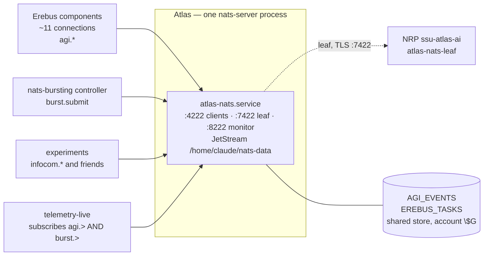
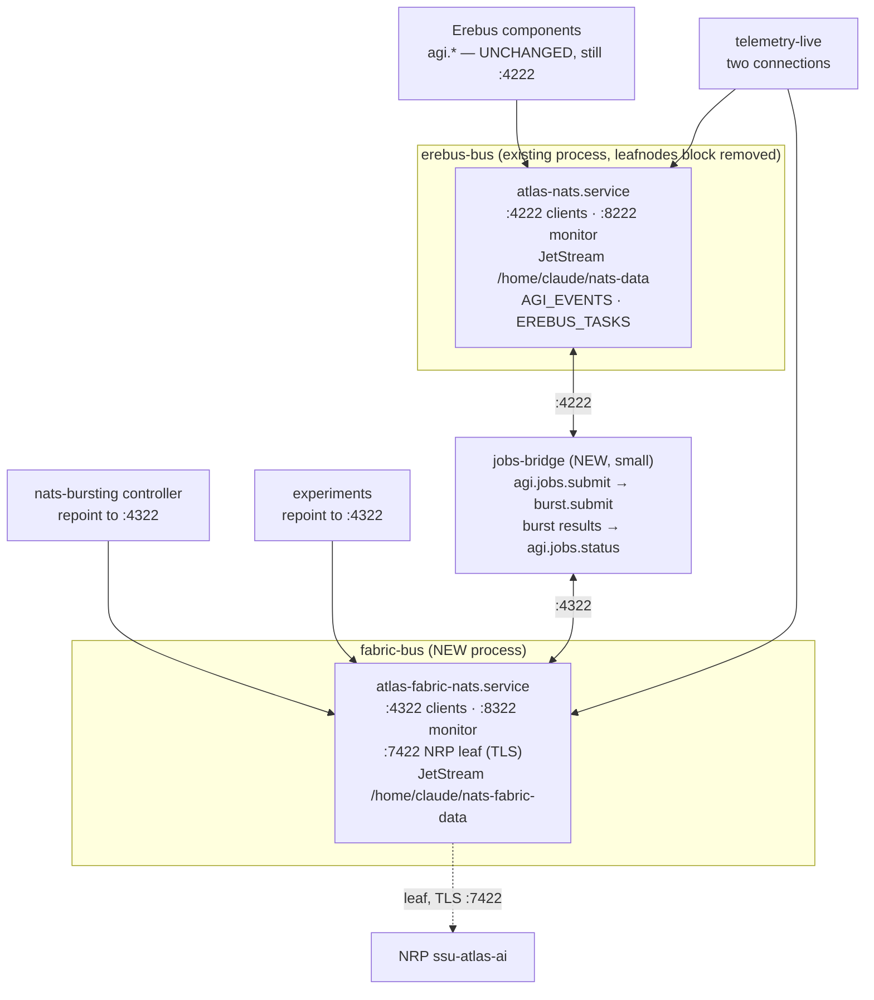
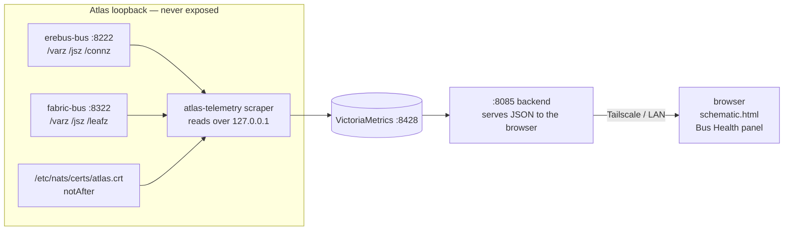

# Design: separating the Erebus workspace bus from the experiment/burst fabric

**Status: DRAFT for review. Nothing in this document has been applied.**
Drafted 2026-07-31 after the NRP leafnode TLS outage
(see `reference_nats_cert_sync` memory).

## 1. Why

Today one `nats-server` process carries three unrelated concerns. Fixing a
certificate for the NRP burst fabric required signalling the same process that
carries Erebus's Global Workspace. That is the coupling worth removing.

Measured on 2026-07-31 on the single `atlas-nats` server:

| | Value |
|---|---|
| Client connections | 14, all on loopback |
| JetStream streams | `AGI_EVENTS` 101,614 msgs / 47.4 MB, `EREBUS_TASKS` 1,260 msgs / 343 KB |
| Durable consumers | **0** |
| JetStream limits | one account, no per-account reservation |
| nats-server | v2.10.24 |

Three concrete problems follow from this, in descending order of how much they
actually matter.

**Operational coupling.** A reload, restart, config error, or certificate change
on the fabric touches Erebus. Today's fix was a `SIGHUP`, which is safe, but a
restart would not have been, and the standing rule "never restart NATS manually"
exists precisely because of this coupling.

**No isolation of the store.** `AGI_EVENTS` and `EREBUS_TASKS` share one account
and one JetStream store with unbounded per-account reservations. A runaway
experiment stream can consume the store that Erebus's workspace persists into.

**No subject isolation.** Workspace subjects and experiment subjects share one
namespace. This is not hypothetical: the connection list currently contains a
leftover subscription from an unrelated networking experiment, sitting on the
same bus as the workspace's safety-check subjects. Access control on the bus is
tracked separately from this design and is deliberately out of scope here.

## 2. Current topology



The subject taxonomy is already clean, which is what makes separation cheap:

| Prefix | Owner | Connections |
|---|---|---|
| `agi.>` | Erebus workspace | ~11 |
| `burst.>` | burst fabric | 1 (`nats-bursting`) |
| `nrp.>` | NRP side | 1 |
| anything else | experiments | 1 observed (`infocom.>`) |

## 3. Proposed topology

Two processes, split on that existing subject boundary. **Erebus keeps :4222**,
so none of the eleven Erebus components need reconfiguration; only the fabric and
experiment clients move.



### 3.1 The one real design decision: bridge, not leaf link

Erebus genuinely needs to reach the fabric — `agi.jobs.submit` and
`agi.jobs.status` are live subjects today. There are two ways to carry that.

**Option A (recommended): a dual-connected bridge process.** One small service
holds a client connection to each bus and translates the two subjects it is
responsible for. Nothing else can cross, because there is no shared subject space
at all. The bridge is independently restartable and its failure is visible and
contained.

**Option B: a leaf link between the two buses, restricted with accounts.**
NATS's own answer, and the right one if you later want general subject federation.
It needs accounts with explicit `exports`/`imports` on both sides, because
leafnode `deny_imports`/`deny_exports` are deny-lists and cannot express
"allow only `agi.jobs.>`".

I recommend A for this case. It achieves the actual goal (no interference) with
no account configuration, no shared subject namespace, and one obvious process to
look at when job submission breaks. Option B is more elegant and more machinery
than the problem needs, and it reintroduces a shared namespace we just removed.

**Consequence to accept with A:** the bridge is a new single point of failure for
job submission. It is not on Erebus's cognitive path, so its failure degrades
compute bursting rather than the workspace, which is the correct place to put the
fragility.

### 3.2 Port allocation

| Service | Clients | Monitor | Leaf listener | JetStream store |
|---|---|---|---|---|
| `atlas-nats` (erebus-bus) | 4222 unchanged | 8222 unchanged | **removed** | `/home/claude/nats-data` unchanged |
| `atlas-fabric-nats` (new) | 4322 | 8322 | 7422 (TLS, NRP) | `/home/claude/nats-fabric-data` |

Nothing about Erebus's config changes except deleting the `leafnodes` block, so
the risk to the workspace is close to zero.

### 3.3 Bind addresses, and why no firewall change is needed

**This split adds no externally reachable port.** The leaf listener is the only
one that needs to cross the network boundary, and the fabric server inherits it on
the same port number, so no forwarding rule changes. That listener is also the one
carrying TLS and leaf authentication.

| Port | Role | Bind |
|---|---|---|
| Erebus clients | workspace bus | loopback |
| Erebus monitor | workspace bus | loopback |
| Leaf listener | NRP leaf, TLS + auth | network-facing, **unchanged** |
| Fabric clients | experiments, bursting | loopback |
| Fabric monitor | experiments, bursting | loopback |

Every port except the leaf listener serves processes on Atlas itself, so all of
them bind to loopback. Where a port is currently bound more broadly than it needs
to be, tightening it is a **separate change** from this split: it is an additional
edit to a file Erebus depends on, so it does not belong in the migration sequence
below, and it should be made on its own with its own verification.

Two consequences of loopback binding are worth stating up front, because they are
easy to discover the hard way. It forces the dashboard to read monitor endpoints
through a process on Atlas rather than from the browser, which is §6.1. And since
`nats-server` accepts a single `listen` host, loopback binding removes remote
access to those ports entirely, for which an SSH local forward
(`ssh -L 8222:127.0.0.1:8222`) is the substitute when debugging.

## 4. Draft configuration

> **Unverified.** I have not tested these against v2.10.24. Before applying I
> would bring up a scratch pair on unused ports (e.g. 4522/8522) and validate the
> link and TLS there, because a config error on `atlas-nats` is exactly the
> outcome this whole exercise exists to avoid.

`/home/claude/nats-fabric.conf` (new):

```
# Experiment + burst fabric. Deliberately separate from the Erebus workspace bus
# on :4222 so that reloads, cert rotation and runaway experiment streams cannot
# affect the Global Workspace.
listen: "127.0.0.1:4322"      # localhost only; nothing remote needs the fabric
http_port: 8322
max_payload: 1048576

jetstream {
  store_dir: "/home/claude/nats-fabric-data"
  max_memory: 2G              # bounded, unlike the workspace bus
  max_file:   32G
}

leafnodes {
  port: 7422                  # moved here from the workspace bus
  tls {
    cert_file: "<cert path>"  # same Caddy-synced cert as today
    key_file:  "<key path>"
    timeout:   5
  }
  authorization {
    # Copy the existing leaf user and its hashed password across verbatim.
    # Do not retype either; a mismatch here is what takes the leaf down.
    users: [ { user: "<existing leaf user>", password: "<existing hash>" } ]
  }
}
```

`/etc/systemd/system/atlas-fabric-nats.service` (new):

```
[Unit]
Description=Atlas NATS — experiment and burst fabric (NRP leaf)
After=network-online.target
Wants=network-online.target

[Service]
Type=simple
User=claude
Group=claude
ExecStart=/home/claude/bin/nats-server -c /home/claude/nats-fabric.conf
ExecReload=/bin/kill -HUP $MAINPID
Restart=on-failure
RestartSec=5

[Install]
WantedBy=multi-user.target
```

Change to `/home/claude/nats.conf`: **delete the `leafnodes { ... }` block.**
That is the only edit. `sync-nats-cert.sh` must then HUP the fabric server
instead of the workspace server (change `pkill -HUP -x nats-server` to signal by
unit: `systemctl reload atlas-fabric-nats`).

## 5. Migration of the JetStream streams

The single most important measured fact: **there are 0 durable consumers.** So
there is no consumer state to preserve, and migration reduces to deciding what
happens to stored messages.

`AGI_EVENTS` and `EREBUS_TASKS` both belong to Erebus and both stay on the
workspace bus, which **already holds them**. So in the recommended layout there
is no stream migration at all. This is the payoff of letting Erebus keep :4222.

```mermaid
sequenceDiagram
  autonumber
  participant Op as Operator
  participant EB as erebus-bus (:4222)
  participant FB as fabric-bus (:4322)
  participant NRP as NRP leaf

  Note over EB: AGI_EVENTS + EREBUS_TASKS stay put. No stream migration.
  Op->>FB: 1. start atlas-fabric-nats (leafnodes on :7422 not yet bound)
  Note over Op,FB: verify on scratch ports first
  Op->>EB: 2. remove leafnodes block from nats.conf
  Op->>EB: 3. systemctl reload atlas-nats (SIGHUP, no client drop)
  Note over EB: :7422 released; NRP leaf drops
  Op->>FB: 4. bind :7422 on fabric, reload
  NRP->>FB: 5. leaf reconnects (~12 s retry loop)
  Op->>FB: 6. repoint nats-bursting to :4322, restart it
  Op->>Op: 7. start jobs-bridge (4222 ↔ 4322)
  Op->>Op: 8. repoint telemetry-live to both buses
```

Steps 2–5 are the only window where NRP bursting is unavailable, on the order of
a minute. Erebus is untouched throughout: step 3 is a reload, and the workspace
subjects and streams never move.

**If a future split does require moving streams**, with 0 consumers the options
are (a) recreate empty on the target and accept losing history, or (b)
`nats stream backup` / `restore`, noting the `nats` CLI is **not** on `claude`'s
PATH (verified 2026-07-18) so it must be installed first.

## 6. Dashboard changes

The most important finding of this whole investigation is a monitoring gap, not a
configuration one. **The dashboard reads no NATS monitor endpoint.** A grep of
`infra/local/atlas-chat/` for `8222`, `leafz`, `varz`, and `jsz` returns nothing.
The NRP leaf was down for six days and nothing showed it. Two tiles would have
caught it on day one.



### 6.1 The tiles must read the monitor ports through the :8085 backend

**This is a hard requirement, not a preference.** The browser rendering
`schematic.html` runs on a laptop, not on Atlas. If the panel's JavaScript fetches
a monitor endpoint directly, those ports have to stay bound beyond loopback, which
defeats §3.3 and leaves an unauthenticated monitor endpoint reachable by anything
that can route to the host. NATS monitor endpoints carry no authentication of
their own, so the bind address is the only thing protecting them.

So every monitor read goes through a process on Atlas. Either the existing
`atlas-telemetry` scraper writes the values into VictoriaMetrics and the panel
queries `:8428`, which is the better path because it also gives history for the
leaf-uptime and cert-expiry series, or the `:8085` backend proxies `/varz`,
`/jsz`, `/leafz` over `127.0.0.1` and re-serves them. Both keep `:8222` and
`:8322` private. Direct browser-to-monitor fetches are out.

The same applies to the cert-expiry tile. `notAfter` is read from a file on
Atlas, so it must be scraped server-side and published as a metric rather than
being derived in the browser.

Proposed additions, in priority order:

1. **`NRP leaf connected` tile** — red when `leafnodes == 0`, scraped by
   `atlas-telemetry` from the fabric monitor endpoint over loopback. This is the
   tile that was missing. Show the peer address and RTT when up, so a flapping
   link is distinguishable from a down one.
2. **`TLS cert days remaining` tile** — from `notAfter` on
   `/etc/nats/certs/atlas.crt`, read server-side and published as a metric. Amber
   under 21 days, red under 7. Catches the cause rather than the symptom.
3. **Two-bus topology in `schematic.html`** — the schematic currently shows one
   bus. It should show both, with per-bus connection counts, so the separation is
   legible to anyone reading the dashboard.
4. **Per-bus JetStream store usage** — bytes and message counts per stream, so a
   runaway experiment stream on the fabric is visible before it matters.
5. **`sync-nats-cert.timer` last-run status** — a failed cert sync should surface,
   since the script now exits non-zero on an expired or missing source.

Per `feedback_dashboard_deploy_drift`: edit only
`infra/local/atlas-chat/*.html`, never copy through the symlink, and deploy with
`ln -sfn`.

## 7. Rollback

Each step reverses cleanly, which is why the ordering above is what it is.

| If this fails | Rollback |
|---|---|
| fabric-bus will not start | Nothing has changed on the workspace bus yet. Stop it and re-examine. |
| leaf will not attach to fabric | Restore the `leafnodes` block in `nats.conf`, reload `atlas-nats`, leaf returns to the old path. |
| `nats-bursting` misbehaves on :4322 | Repoint it back to :4222 and leave both buses running. |
| bridge is unreliable | Erebus job submission degrades; the workspace is unaffected. Fall back to Option B or to a direct fabric connection from the submitting component. |

The `leafnodes` block removal is the only edit to a file Erebus depends on, and it
is a three-line deletion that a backup restores.

## 8. Open questions for review

1. **Should the fabric bus have JetStream at all?** I proposed a small bounded
   store. If nothing on the fabric needs persistence, dropping it removes a whole
   class of failure. Worth checking whether `burst.>` or `nrp.>` consumers rely
   on replay.
2. **Per-client authentication on the workspace bus.** Separating the buses
   reduces what a misbehaving local process can reach, but it does not by itself
   authenticate clients. Adding a credential for workspace clients would touch all
   eleven Erebus components, so it belongs in its own piece of work rather than
   riding along with this split.
3. **Who owns the bridge?** It could equally live inside an existing Erebus
   component. A standalone unit is easier to reason about and restart, which is
   why I drafted it that way, but it is one more service to run.
4. **Does anything besides `telemetry-live` subscribe across both domains?**
   The connection dump shows one unnamed client on `nrp.>` whose owner I did not
   identify. It should be attributed before the move.
