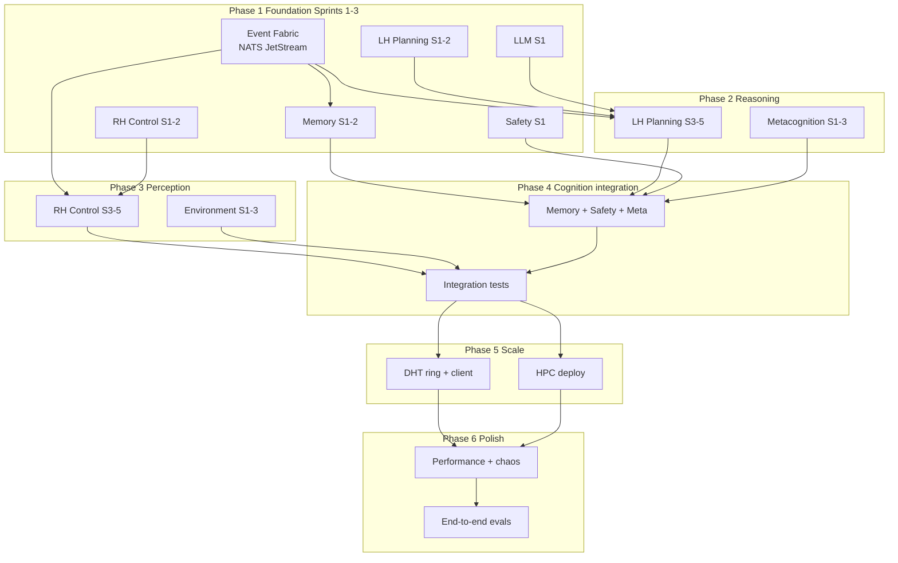

# AGI-HPC Master Implementation Plan

## Executive Summary

This document provides a high-level plan for implementing all remaining sprint plans across the AGI-HPC cognitive architecture. The plan is organized into 6 phases spanning approximately 64 sprints across 10 subsystems, prioritized by dependencies and critical path analysis.

---

## Current State

*Updated after Sprint 6 completion.*

| Subsystem | Total Sprints | Implemented | Remaining | Notes |
|-----------|---------------|-------------|-----------|-------|
| Event Fabric | 8 | 6 | 2 | S1-5 core + S6 NATS JetStream backend |
| LH Planning | 6 | 6 | 0 | S1-5 core + S6 performance (LRUCache, AsyncBatcher) + HPC deploy (Slurm, Apptainer) |
| RH Control | 8 | 6 | 2 | S1-5 core + S6 advanced control (motor primitives, trajectory, realtime controllers, robot interface, simulation) |
| Memory | 8 | 5 | 3 | S1-5 unified service + S6 integration tests (LH/Safety/RH memory) |
| Metacognition | 8 | 6 | 2 | S1-5 reasoning analyzer + consistency + anomaly detection + S6 LLM reflection |
| Safety | 8 | 6 | 2 | S1-5 gateway + rules + ErisML + S6 learning service (Bayesian rule weights) |
| DHT | 6 | 6 | 0 | S1-5 ring + storage + client + state manager + S6 observability + HPC + security |
| LLM | 6 | 6 | 0 | S1-5 client + providers + middleware + S6 subsystem integration points |
| Environment | 6 | 5 | 1 | S1-5 base + backends + observations + actions + fusion + recording + S6 unit tests |
| Integration | 4 | 1 | 3 | S6 E2E framework, chaos testing, integration conftest |
| **Total** | **68** | **~53** | **~15** |

---

## Dependency Graph



<details>
<summary>ASCII dependency graph</summary>

```
                            ┌─────────────────────────────────────────────────────┐
                            │                    PHASE 1                          │
                            │              Foundation Layer                        │
                            └─────────────────────────────────────────────────────┘
                                                    │
                    ┌───────────────────────────────┼───────────────────────────────┐
                    │                               │                               │
                    ▼                               ▼                               ▼
            ┌───────────────┐               ┌───────────────┐               ┌───────────────┐
            │ Event Fabric  │               │     LLM       │               │  Environment  │
            │  Sprints 1-2  │               │   Sprint 1    │               │   Sprint 1    │
            └───────────────┘               └───────────────┘               └───────────────┘
                    │                               │                               │
                    └───────────────────────────────┼───────────────────────────────┘
                                                    │
                            ┌─────────────────────────────────────────────────────┐
                            │                    PHASE 2                          │
                            │             Core Cognitive Services                  │
                            └─────────────────────────────────────────────────────┘
                                                    │
            ┌───────────────────────────────────────┼───────────────────────────────────────┐
            │                       │               │               │                       │
            ▼                       ▼               ▼               ▼                       ▼
    ┌───────────────┐       ┌───────────────┐ ┌───────────────┐ ┌───────────────┐   ┌───────────────┐
    │    Memory     │       │  LH Planning  │ │   RH Control  │ │    Safety     │   │     DHT       │
    │  Sprints 1-2  │       │  Sprints 1-2  │ │  Sprints 1-2  │ │   Sprint 1    │   │   Sprint 1    │
    └───────────────┘       └───────────────┘ └───────────────┘ └───────────────┘   └───────────────┘
            │                       │               │               │                       │
            └───────────────────────┼───────────────┼───────────────┼───────────────────────┘
                                    │               │               │
                            ┌─────────────────────────────────────────────────────┐
                            │                    PHASE 3                          │
                            │               Integration Layer                      │
                            └─────────────────────────────────────────────────────┘
                                                    │
                    ┌───────────────────────────────┼───────────────────────────────┐
                    │                               │                               │
                    ▼                               ▼                               ▼
            ┌───────────────┐               ┌───────────────┐               ┌───────────────┐
            │ Metacognition │               │  LH ↔ RH ↔    │               │  Environment  │
            │  Sprints 1-3  │               │ Memory ↔ Safe │               │  Sprints 2-3  │
            └───────────────┘               └───────────────┘               └───────────────┘
                    │                               │                               │
                    └───────────────────────────────┼───────────────────────────────┘
                                                    │
                            ┌─────────────────────────────────────────────────────┐
                            │                    PHASE 4                          │
                            │               Advanced Features                      │
                            └─────────────────────────────────────────────────────┘
                                                    │
    ┌───────────────────────────────────────────────┼───────────────────────────────────────────────┐
    │               │               │               │               │               │               │
    ▼               ▼               ▼               ▼               ▼               ▼               ▼
┌────────┐    ┌────────┐    ┌────────┐    ┌────────┐    ┌────────┐    ┌────────┐    ┌────────┐
│ Memory │    │   LH   │    │   RH   │    │ Safety │    │  Meta  │    │  Env   │    │  DHT   │
│ Spr3-4 │    │ Spr3-4 │    │ Spr3-5 │    │ Spr2-4 │    │ Spr4-6 │    │ Spr4-5 │    │ Spr2-3 │
└────────┘    └────────┘    └────────┘    └────────┘    └────────┘    └────────┘    └────────┘
                                                    │
                            ┌─────────────────────────────────────────────────────┐
                            │                    PHASE 5                          │
                            │               Testing & Quality                      │
                            └─────────────────────────────────────────────────────┘
                                                    │
    ┌───────────────────────────────────────────────┼───────────────────────────────────────────────┐
    │               │               │               │               │               │               │
    ▼               ▼               ▼               ▼               ▼               ▼               ▼
┌────────┐    ┌────────┐    ┌────────┐    ┌────────┐    ┌────────┐    ┌────────┐    ┌────────┐
│ Memory │    │   LH   │    │   RH   │    │ Safety │    │  Meta  │    │  LLM   │    │  Fab   │
│ Spr5-6 │    │  Spr2  │    │  Spr2  │    │  Spr7  │    │  Spr7  │    │  Spr5  │    │  Spr8  │
└────────┘    └────────┘    └────────┘    └────────┘    └────────┘    └────────┘    └────────┘
                                                    │
                            ┌─────────────────────────────────────────────────────┐
                            │                    PHASE 6                          │
                            │         Production Hardening & Integration           │
                            └─────────────────────────────────────────────────────┘
                                                    │
    ┌───────────────────────────────────────────────┼───────────────────────────────────────────────┐
    │               │               │               │               │               │               │
    ▼               ▼               ▼               ▼               ▼               ▼               ▼
┌────────┐    ┌────────┐    ┌────────┐    ┌────────┐    ┌────────┐    ┌────────┐    ┌────────┐
│ Memory │    │   LH   │    │   RH   │    │ Safety │    │  Meta  │    │  Integ │    │  All   │
│ Spr7-8 │    │ Spr5-6 │    │ Spr7-8 │    │  Spr8  │    │  Spr8  │    │ Spr1-4 │    │ Prod   │
└────────┘    └────────┘    └────────┘    └────────┘    └────────┘    └────────┘    └────────┘
```

</details>

---

## Phase 1: Foundation Layer

**Goal**: Establish core infrastructure that all other components depend on.

**Duration**: Sprints 1-3 across subsystems

### 1.1 Event Fabric (Critical Path)

| Sprint | Goal | Key Deliverables |
|--------|------|------------------|
| **Sprint 1** | ZMQ Broker | XPUB/XSUB broker, Docker container, HA config |
| **Sprint 2** | Redis Streams | Persistent messaging, replay API, DLQ |

**Why First**: All inter-component communication flows through the Event Fabric. Without it, no component can publish events to others.

### 1.2 LLM Infrastructure

| Sprint | Goal | Key Deliverables |
|--------|------|------------------|
| **Sprint 1** | Core Client | Provider protocol, Anthropic/OpenAI/Ollama adapters, unified client |

**Why First**: LH Planner and Metacognition need LLM access for plan generation and review.

### 1.3 Environment Interface

| Sprint | Goal | Key Deliverables |
|--------|------|------------------|
| **Sprint 1** | Core Protocol | Environment base class, observation/action types, configuration |

**Why First**: RH Control needs environment abstraction to simulate actions.

### Phase 1 Exit Criteria
- [x] Event Fabric can route messages between any two components
- [x] LLM client can generate completions from at least one provider
- [x] Environment interface can be instantiated (even with mock backend)

---

## Phase 2: Core Cognitive Services

**Goal**: Implement the fundamental cognitive loop (Plan → Execute → Observe → Remember).

**Duration**: Sprints 1-2 of each cognitive component

### 2.1 Memory Subsystem

| Sprint | Goal | Key Deliverables |
|--------|------|------------------|
| **Sprint 1** | Semantic Memory | Qdrant integration, embedding generation, similarity search |
| **Sprint 2** | Episodic Memory | Temporal storage, episode structure, PostgreSQL backend |

**Dependencies**: Event Fabric for memory events, LLM for embeddings

### 2.2 LH Planning

| Sprint | Goal | Key Deliverables |
|--------|------|------------------|
| **Sprint 1** | Core Service | gRPC server, PlanService, plan graph structure |
| **Sprint 2** | Unit Tests | 80%+ coverage, mock dependencies |

**Dependencies**: Event Fabric for `plan.step_ready`, LLM for plan generation, Memory for context

### 2.3 RH Control

| Sprint | Goal | Key Deliverables |
|--------|------|------------------|
| **Sprint 1** | Core Service | gRPC server, world model, perception pipeline |
| **Sprint 2** | Unit Tests | Mock sensors/actuators, state machine tests |

**Dependencies**: Event Fabric for `simulation.result`, Environment for observations

### 2.4 Safety Subsystem

| Sprint | Goal | Key Deliverables |
|--------|------|------------------|
| **Sprint 1** | Service Implementation | Pre/In/Post-Action services, SafetyGateway integration |

**Dependencies**: Event Fabric for `safety.decision`, Memory for decision proofs

### 2.5 DHT

| Sprint | Goal | Key Deliverables |
|--------|------|------------------|
| **Sprint 1** | Core Infrastructure | Hash ring, virtual nodes, basic CRUD |

**Dependencies**: None (foundational distributed storage)

### Phase 2 Exit Criteria
- [x] LH can generate a plan and publish `plan.step_ready`
- [x] RH can receive plan steps and publish `simulation.result`
- [x] Memory can store and retrieve semantic/episodic data
- [x] Safety can evaluate actions (ALLOW/DENY/DEFER)
- [x] DHT can store/retrieve key-value pairs

---

## Phase 3: Integration Layer

**Goal**: Wire up the cognitive loop so components work together end-to-end.

**Duration**: Sprint 3 of LH/RH + Metacognition Sprints 1-3

### 3.1 LH ↔ RH ↔ Memory ↔ Safety Integration

| Component | Sprint | Integration Focus |
|-----------|--------|-------------------|
| LH | Sprint 3 | Integration tests, E2E pipeline |
| RH | Sprint 3 | Integration with LH, Safety callbacks |
| Memory | Sprint 4 | Unified memory service |
| Safety | Sprint 3 | ErisML full integration |

**Key Integration Points**:
1. LH enriches plans with Memory context
2. LH sends plans through Safety pre-check
3. RH executes approved steps via Environment
4. RH logs episodes to Memory
5. Safety stores decision proofs in Memory

### 3.2 Metacognition Bootstrap

| Sprint | Goal | Key Deliverables |
|--------|------|------------------|
| **Sprint 1** | Proto & Core Service | MetaService gRPC, review interface |
| **Sprint 2** | Reasoning Trace Analysis | Trace parser, pattern detection |
| **Sprint 3** | Consistency Checking | Cross-component validation |

**Dependencies**: LH for plans to review, Event Fabric for `meta.review`

### 3.3 Environment Backends

| Sprint | Goal | Key Deliverables |
|--------|------|------------------|
| **Sprint 2** | Simulation Backends | MuJoCo, PyBullet implementations |
| **Sprint 3** | Sensor Fusion | Kalman filter, object tracking |

**Dependencies**: Core protocol from Phase 1

### Phase 3 Exit Criteria
- [x] End-to-end flow: Goal → Plan → Safety Check → Execute → Observe → Remember
- [x] Metacognition can review and critique LH plans
- [x] At least one simulation backend (MuJoCo) is functional
- [x] Integration tests pass for cognitive loop

---

## Phase 4: Advanced Features

**Goal**: Add sophisticated capabilities to each subsystem.

**Duration**: Middle sprints of each component

### 4.1 Memory Advanced

| Sprint | Goal | Key Deliverables |
|--------|------|------------------|
| **Sprint 3** | Procedural Memory | Skill learning, parameter adaptation |
| **Sprint 4** | Unified Service | Cross-memory queries, consistency |

### 4.2 LH Advanced

| Sprint | Goal | Key Deliverables |
|--------|------|------------------|
| **Sprint 3** | Integration Testing | E2E with RH/Memory/Safety |
| **Sprint 4** | Real LLM Planning | Anthropic/OpenAI for complex plans |

### 4.3 RH Advanced

| Sprint | Goal | Key Deliverables |
|--------|------|------------------|
| **Sprint 4** | Perception Pipeline | Object detection, segmentation |
| **Sprint 5** | Physics World Model | Predictive simulation |

### 4.4 Safety Advanced

| Sprint | Goal | Key Deliverables |
|--------|------|------------------|
| **Sprint 2** | Rule Engine | YAML policies, hot-reload |
| **Sprint 3** | ErisML Integration | Full ethical evaluation |
| **Sprint 4** | Reflex Layer | <100μs hardware safety |

### 4.5 Metacognition Advanced

| Sprint | Goal | Key Deliverables |
|--------|------|------------------|
| **Sprint 4** | Confidence Calibration | Uncertainty estimation |
| **Sprint 5** | Anomaly Detection | Out-of-distribution detection |
| **Sprint 6** | LLM Reflection | Claude/GPT-based critique |

### 4.6 Environment Advanced

| Sprint | Goal | Key Deliverables |
|--------|------|------------------|
| **Sprint 4** | ROS2 Bridge | Real robot communication |
| **Sprint 5** | Recording/Playback | HDF5 episodes |

### 4.7 DHT Advanced

| Sprint | Goal | Key Deliverables |
|--------|------|------------------|
| **Sprint 2** | Node Server | gRPC, replication |
| **Sprint 3** | Failure Detection | Gossip protocol, data migration |

### 4.8 Event Fabric Advanced

| Sprint | Goal | Key Deliverables |
|--------|------|------------------|
| **Sprint 3** | Schema Validation | Pydantic schemas, versioning |
| **Sprint 4** | Wildcard Subscriptions | Pattern matching |
| **Sprint 5** | Observability | Prometheus, tracing |

### 4.9 LLM Advanced

| Sprint | Goal | Key Deliverables |
|--------|------|------------------|
| **Sprint 2** | Middleware | Cache, rate limit, retry |
| **Sprint 3** | Prompt Management | Templates, versioning |
| **Sprint 4** | Observability | Cost tracking, metrics |

### Phase 4 Exit Criteria
- [x] Memory consolidation works across types
- [x] LH uses real LLM for planning
- [x] RH has perception pipeline
- [ ] Safety reflex layer has <100μs latency
- [x] Metacognition provides calibrated confidence scores
- [x] Environment can connect to ROS2

---

## Phase 5: Testing & Quality

**Goal**: Achieve comprehensive test coverage and verification.

**Duration**: Testing sprints from each component

### Test Matrix

| Component | Unit Tests | Integration | Fuzz/Property | E2E |
|-----------|------------|-------------|---------------|-----|
| Event Fabric | Sprint 8 | Sprint 8 | - | - |
| Memory | Sprint 5 | Sprint 6 | - | Sprint 6 |
| LH | Sprint 2 | Sprint 3 | - | Sprint 3 |
| RH | Sprint 2 | Sprint 3 | - | Sprint 3 |
| Safety | Sprint 7 | Sprint 7 | Sprint 7 | Sprint 7 |
| Metacognition | Sprint 7 | Sprint 8 | - | Sprint 8 |
| DHT | Sprint 4 | Sprint 5 | - | Sprint 5 |
| LLM | Sprint 5 | Sprint 6 | - | - |
| Environment | Sprint 6 | Sprint 6 | - | - |

### Coverage Targets

| Component | Target | Focus Areas |
|-----------|--------|-------------|
| All | 80%+ | Critical paths |
| Safety | 95%+ | All safety checks |
| DHT | 85%+ | Consistency, replication |

### Phase 5 Exit Criteria
- [x] All components have 80%+ unit test coverage
- [ ] Integration tests cover all event flows
- [ ] Safety fuzzing reveals no critical issues
- [ ] Performance benchmarks established

---

## Phase 6: Production Hardening & System Integration

**Goal**: Prepare the entire system for deployment.

**Duration**: Final sprints from each component + Integration sprints

### 6.1 Component Production Hardening

| Component | Sprint | Focus |
|-----------|--------|-------|
| Memory | 7-8 | Distribution, HA, backup |
| LH | 5-6 | Memory integration, production config |
| RH | 7-8 | World persistence, Kubernetes |
| Safety | 8 | HA, mTLS, audit export |
| Metacognition | 8 | Production observability |
| Event Fabric | 6-7 | NATS JetStream, HPC optimizations |
| DHT | 6 | Observability, security |
| LLM | 6 | Component integration |
| Environment | - | (Completed in Phase 4) |

### 6.2 System Integration

| Sprint | Goal | Key Deliverables |
|--------|------|------------------|
| **Integration Sprint 1** | Component Contracts | Interface verification |
| **Integration Sprint 2** | E2E Cognitive Loop | Full cycle testing |
| **Integration Sprint 3** | Multi-Node Deployment | Kubernetes, DHT distribution |
| **Integration Sprint 4** | Production Readiness | Runbooks, monitoring, DR |

### 6.3 Infrastructure Requirements

| Technology | Purpose | Phase |
|------------|---------|-------|
| PostgreSQL + PostGIS | Episodic memory, world state | Phase 2 |
| Qdrant | Semantic vector search | Phase 2 |
| Redis | Caching, rate limiting | Phase 1 |
| RocksDB | DHT persistent storage | Phase 4 |
| ZeroMQ | Event Fabric transport | Phase 1 |
| NATS JetStream | Production messaging | Phase 6 |
| Kubernetes | Orchestration | Phase 6 |
| Prometheus/Grafana | Observability | Phase 4-6 |
| Jaeger | Distributed tracing | Phase 4-6 |

### Phase 6 Exit Criteria
- [ ] All components deploy to Kubernetes
- [ ] System handles node failures gracefully
- [x] Observability dashboards operational (DHT metrics/tracing, LH observability)
- [ ] Disaster recovery tested
- [x] Security audit passed (DHT mTLS, encryption, access control, audit logging)
- [x] Documentation complete

---

## Critical Path Summary

The following is the minimum path to a working cognitive system:

```
1. Event Fabric Sprint 1 (messaging foundation)
       ↓
2. LLM Sprint 1 (provider abstraction)
       ↓
3. Memory Sprint 1 (semantic storage)
       ↓
4. LH Sprint 1 (plan generation)
       ↓
5. Environment Sprint 1 (observation protocol)
       ↓
6. RH Sprint 1 (action execution)
       ↓
7. Safety Sprint 1 (pre-action checks)
       ↓
8. Integration Sprint 1 (wire everything together)
       ↓
   ✓ MINIMAL VIABLE COGNITIVE LOOP
```

---

## Resource Requirements

### Development Team Structure

| Role | Count | Focus |
|------|-------|-------|
| Core Platform Engineers | 2 | Event Fabric, DHT, Infrastructure |
| Cognitive Systems Engineers | 2 | LH, RH, Metacognition |
| ML/AI Engineers | 2 | LLM, Memory (embeddings), Safety (ErisML) |
| Robotics Engineers | 1 | Environment, ROS2, Simulation |
| QA/Test Engineers | 1 | Testing across all components |
| DevOps/SRE | 1 | Kubernetes, observability, production |

### Infrastructure Costs (Estimated)

| Resource | Purpose | Monthly Cost |
|----------|---------|--------------|
| GPU Instances | LLM inference, embeddings | $500-2000 |
| Vector DB | Qdrant cluster | $200-500 |
| PostgreSQL | RDS or managed | $100-300 |
| Redis | ElastiCache or managed | $50-150 |
| Kubernetes | EKS/GKE cluster | $300-800 |
| LLM API | Anthropic/OpenAI credits | $500-5000 |

---

## Risk Mitigation

| Risk | Impact | Mitigation |
|------|--------|------------|
| Event Fabric bottleneck | High | NATS JetStream, horizontal scaling |
| LLM latency | Medium | Caching, smaller models for drafts |
| Memory consistency | High | CRDT for distributed memory |
| Safety false positives | Medium | Calibration, human review (DEFER) |
| DHT partition | High | Quorum reads/writes, anti-entropy |
| Environment sim-to-real gap | Medium | Domain randomization, ROS2 bridge |

---

## Success Metrics

### Phase Completion Criteria

| Phase | Key Metric | Target |
|-------|------------|--------|
| Phase 1 | Event routing latency | < 10ms p99 |
| Phase 2 | Cognitive loop completion | > 95% success |
| Phase 3 | E2E plan execution | > 80% success |
| Phase 4 | Safety reflex latency | < 100μs |
| Phase 5 | Test coverage | > 80% all components |
| Phase 6 | System availability | > 99.9% |

### Final System KPIs

| Metric | Target |
|--------|--------|
| Plan generation latency | < 5s for simple goals |
| Safety evaluation latency | < 100ms pre-action |
| Memory retrieval latency | < 50ms semantic search |
| Action execution frequency | > 10 Hz control loop |
| System uptime | > 99.9% |

---

## Next Steps

*Sprints 1-6 are complete across all subsystems. Remaining work:*

1. **Safety Sprints 7-8**: Reflex layer hardware integration (<100μs), HA deployment, mTLS production hardening
2. **RH Sprints 7-8**: World model persistence, Kubernetes deployment
3. **Metacognition Sprints 7-8**: Production observability, integration testing with full cognitive loop
4. **Memory Sprints 6-8**: Distribution, HA, backup and restore
5. **Event Fabric Sprints 7-8**: HPC optimizations, full observability
6. **Integration Sprints 2-4**: E2E cognitive loop testing, multi-node Kubernetes deployment, production readiness

---

## Appendix: Sprint Cross-Reference

| Phase | Event Fabric | LLM | Memory | LH | RH | Safety | Meta | DHT | Env | Integration |
|-------|--------------|-----|--------|----|----|--------|------|-----|-----|-------------|
| 1 | 1-2 | 1 | - | - | - | - | - | - | 1 | - |
| 2 | - | - | 1-2 | 1-2 | 1-2 | 1 | - | 1 | - | - |
| 3 | - | - | 4 | 3 | 3 | 3 | 1-3 | - | 2-3 | - |
| 4 | 3-5 | 2-4 | 3 | 4 | 4-5 | 2-4 | 4-6 | 2-3 | 4-5 | - |
| 5 | 8 | 5 | 5-6 | 2 | 2 | 7 | 7 | 4-5 | 6 | - |
| 6 | 6-7 | 6 | 7-8 | 5-6 | 7-8 | 8 | 8 | 6 | - | 1-4 |
