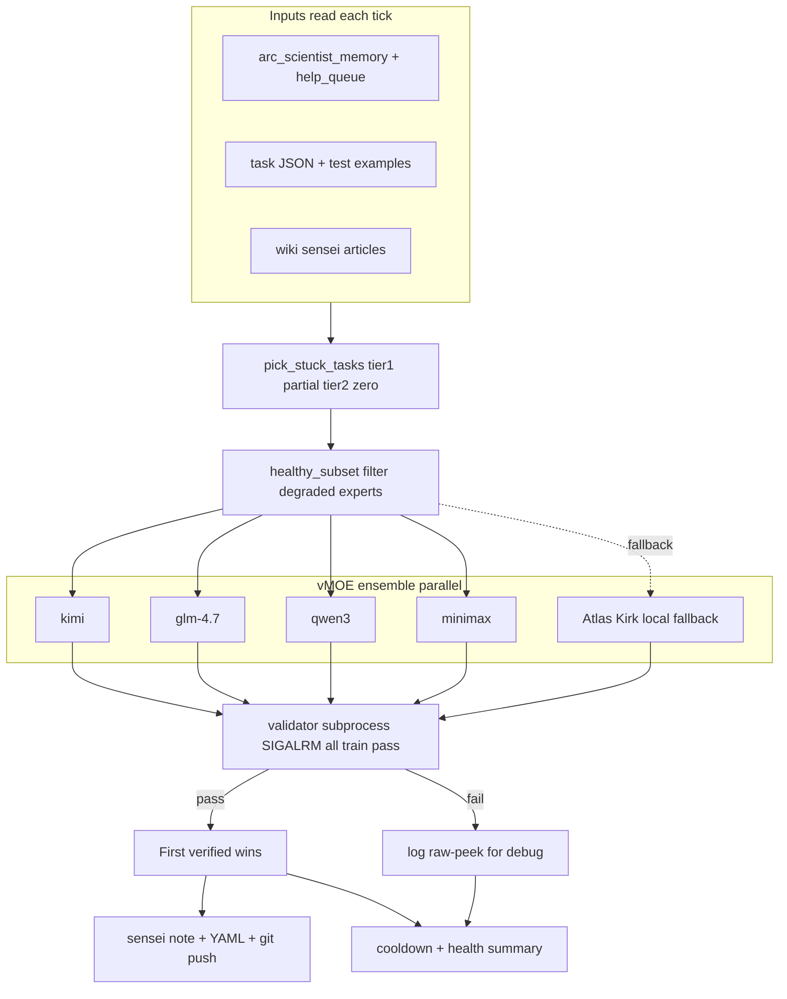

# The Primer

> *"The Primer, as it came to be called, was the fruit of that labour."*
> — Neal Stephenson, *The Diamond Age*, 1995

**The Primer** is Atlas's always-on teaching daemon for Erebus, the autonomous ARC-AGI scientist. It is named for Stephenson's *Young Lady's Illustrated Primer* — an adaptive, interactive tutor that meets its student at their current confusion and walks them through to understanding. Erebus is Nell.

Service: `atlas-primer.service` on Atlas (CPU-only). Polls every 10 min. Source: [`src/agi/primer/`](../src/agi/primer/).

---

## Why it exists

The ARC Scientist learns by trying many strategies and reflecting on failures, but it has two structural limits:

1. **Per-attempt time pressure.** Each arc_scientist LLM call is single-shot under a ~60-120 s budget. Hard tasks with subtle rules don't yield to single-shot reasoning.
2. **No cross-attempt synthesis.** The Scientist records per-task attempt history, but it can't step back and reason over 30 failures holistically to spot the misconception.

Human sensei notes (the `wiki/sensei_task_NNN.md` articles prepended to prompts) close the gap — when they're correct. The task056 incident showed they're also dangerous when wrong: a confidently-incorrect note actively misled 30+ attempts before being caught.

The Primer replaces the human-in-the-loop sensei with a *verified* auto-sensei. Its claim:

> **Frontier-reasoning (NRP Kimi + GLM + Qwen3) + full Erebus context (wiki + episodic memory) + verify-against-train loop** = a teaching layer strictly more capable than a single human writing notes in-session.

Why each ingredient matters:

- **Full context** — the Primer sees every prior attempt, error classification, strategy trace, and every existing wiki article. A human writing a note in-session typically has the task JSON alone.
- **Ensemble over single-model** — one bad night for Kimi doesn't stop progress; qwen3 or GLM-4.7 might still find the rule.
- **Verify-against-train before publish** — no unverified note ever reaches the wiki. Safety invariant 1.

---

## Architecture



### ASCII reference

```
                                     ┌───────────────────────┐
                                     │   /archive/neurogolf  │
                                     │                       │
                 ┌───────── reads ───│   arc_scientist_      │
                 │                   │   memory.json         │
                 │  ┌──── reads ────│   task*.json          │
                 │  │                │   erebus_help_queue   │
                 │  │                └───────────────────────┘
                 │  │                ┌───────────────────────┐
                 │  │   ┌── reads ──│   wiki/               │
                 │  │   │            │   sensei_task_*.md    │
                 │  │   │            │   sensei_meta_*.md    │
                 │  │   │            └───────────────────────┘
                 ▼  ▼   ▼
           ┌─────────────────┐       ┌─────────────────────────────────┐
           │                 │  fan  │       NRP ellm :v1               │
           │   THE PRIMER    │  out  │                                  │
           │   (vMOE core)   │─────► │   kimi         GLM-4.7           │
           │                 │       │   qwen3        MiniMax-M2        │
           │   service.py    │ ◄──── │                                  │
           │                 │ all   │   + Atlas Kirk (local fallback)  │
           └────────┬────────┘       └─────────────────────────────────┘
                    │
           ┌────────▼────────┐
           │ validator.py    │      subprocess sandbox, SIGALRM per-example,
           │ run vs train    │      coerce output to list[list[int]], all_pass = True
           └────────┬────────┘
                    │
            ┌───────┴───────┐
      pass  │               │  fail
    ┌───────▼───────┐   ┌───▼──────────────┐
    │ write         │   │ log raw-peek     │
    │ sensei_task_  │   │ (first 400 chars)│
    │ NNN.md        │   │ for debug;       │
    │ with YAML     │   │ next task        │
    │ frontmatter   │   └──────────────────┘
    │               │
    │ git add/      │
    │ commit/push   │
    └───────────────┘
```

### Tick loop

Every `PRIMER_POLL_S` seconds (default 600 = 10 min):

1. **Pick candidates** — `_pick_stuck_tasks()` reads the memory file, excludes solved and cooldowned tasks, and tiers the remainder:
   - *Tier 1* — partial progress (`best_correct > 0`) AND ≥ `PRIMER_MIN_ATTEMPTS` attempts.
   - *Tier 2* — zero progress, ≥ `PRIMER_MIN_ATTEMPTS` attempts.
   Within each tier, most-attempted first. Tier 1 ahead of Tier 2 because "one nudge away" is higher-yield than "nobody has cracked this yet".
2. **Process top 3** — serial. Each task:
   1. Assemble context: stripped task JSON (train + up to 3 test; `arc-gen` dropped), attempt history summary (last 3 failed attempts with diagnoses), existing `sensei_task_NNN.md` if any, all `sensei_meta_*.md` meta notes (first 3000 chars each).
   2. Health-filter experts — `moe.healthy_subset(["kimi", "glm-4.7", "qwen3"])`. If all degraded, still probe qwen3 once as a canary.
   3. `moe.ensemble(...)` fires the healthy experts in parallel with 12 000 max tokens.
   4. For each response: `extract_code()` → `validate()` against `task.train`. First verified wins; note is published. Non-verified responses logged with raw-peek for debug.
3. **Persist state** — cooldown timestamp set regardless of outcome; expert health summary written to `/archive/neurogolf/primer_health.json` for dashboard consumption.
4. **Sleep** `PRIMER_POLL_S`.

### Publishing

The published note has YAML frontmatter:

```yaml
---
type: sensei_note
task: 056
tags: [classification, symmetry-classifier, arc, primer]
written_by: The Primer
written_at: 2026-04-19
verified_by: run-against-train (all examples pass)
---
```

followed by the model's `note` field. If the model forgot to include a `## Reference implementation` section, the Primer appends one from the `code` field.

Git operations:

```
git -C /home/claude/agi-hpc add wiki/sensei_task_NNN.md
git -C /home/claude/agi-hpc commit -m "primer: verified sensei note for task NNN (family)"
git -C /home/claude/agi-hpc push
```

CI picks up the push; deploy-smoke and dashboard-render workflows fire on each commit.

---

## Safety invariants

1. **Verify before publish.** A wrong mentor note is worse than no note. `validate(code, task)` must return `all_pass=True` or the response is dropped. No heuristic fallbacks, no partial-credit publishing. See [`feedback_sensei_verify_solutions`](https://github.com/ahb-sjsu/...) (personal memory).
2. **Never crash the loop.** `_main_async()` wraps each `tick()` in `try / except Exception` with logging; an error on one task never kills the daemon.
3. **Never overwrite without re-verification.** If a `sensei_task_NNN.md` already exists, the new one must also pass verification; a failed-verify response leaves the existing note intact.
4. **Cooldown respect.** Each task is touched at most once per `PRIMER_COOLDOWN_S` (default 6 h), regardless of verify outcome. Stops runaway re-attempts on tasks the ensemble consistently can't crack.
5. **Resource caps.** Systemd unit enforces `MemoryMax=4G` and `CPUQuota=200%`. Each expert call has its own wall-clock budget via the vMOE's asyncio timeout.

---

## Expert health tracking

Managed LLM endpoints have time-of-day load variance. When a heavy reasoning model has timed out its last N calls, the next N are overwhelmingly likely to time out too. Keep calling them and we burn wall-clock per tick for nothing.

`agi.primer.health.HealthTracker`:

- **Window** — last 5 calls per expert.
- **Unhealthy** — call failed (timeout / error) OR returned slower than `slow_s` (default 180 s) even if ok.
- **Degradation trigger** — ≥ 3 unhealthy in the window flips the expert into a cooldown.
- **Cooldown** — 1 h (default). During cooldown, the Primer skips that expert. After cooldown, it probes once; if the probe is healthy, cooldown ends.
- **Summary** — `moe.health.summary()` returns per-expert `{healthy, degraded_until_s, window_size, unhealthy_in_window, avg_latency_s}`. Persisted each tick to `/archive/neurogolf/primer_health.json`. Exposed via `/api/primer/status.expert_health` for the dashboard.

The canary pattern: qwen3 is the fastest model in the pool. If qwen3 is consistently slow, NRP as a whole is slow and the heavier thinking models (Kimi, GLM-4.7) will definitely time out. Tracking qwen3's health lets us skip the heavy models during slow windows and save tokens.

---

## Environment

Read from `~/.primer.env` by the systemd unit:

| Variable | Default | Purpose |
|---|---|---|
| `NRP_LLM_TOKEN` | (required) | Bearer token for `https://ellm.nrp-nautilus.io/v1` |
| `EREBUS_WIKI_DIR` | `/home/claude/agi-hpc/wiki` | Where sensei notes are read + written |
| `EREBUS_MEMORY_PATH` | `/archive/neurogolf/arc_scientist_memory.json` | Full episodic memory |
| `EREBUS_TASK_DIR` | `/archive/neurogolf` | Directory of `task*.json` |
| `EREBUS_HELP_PATH` | `/archive/neurogolf/erebus_help_queue.json` | Stuck-task markers |
| `EREBUS_REPO_DIR` | `/home/claude/agi-hpc` | Repo to `git commit` + `push` from |
| `PRIMER_POLL_S` | `300` → `600` (set in prod env file) | Sleep between ticks |
| `PRIMER_MIN_ATTEMPTS` | `10` | Only process tasks with ≥ this many prior attempts |
| `PRIMER_COOLDOWN_S` | `21600` (6 h) | Min gap between re-processing same task |
| `EREBUS_VMOE_EXPERTS` | unset = all | Comma-separated subset of expert names |
| `PRIMER_LOG_LEVEL` | `INFO` | Python logging level |

---

## Operation

```bash
# Install unit + enable
sudo cp deploy/systemd/atlas-primer.service /etc/systemd/system/
sudo systemctl daemon-reload
sudo systemctl enable --now atlas-primer.service

# Live log
sudo journalctl -u atlas-primer.service -f

# One-shot smoke test (dry cooldown)
PRIMER_COOLDOWN_S=0 python -m agi.primer.service  # then Ctrl-C after one tick

# Check health state
cat /archive/neurogolf/primer_health.json
curl -sk https://atlas-sjsu.duckdns.org/api/primer/status | jq .
```

### Restart policy and recovery

The unit sets `Restart=always`, `StartLimitBurst=5` / `StartLimitIntervalSec=600`, and `RandomizedDelaySec=15`. A clean `exit 0` from the main loop is treated as a bug (the loop shouldn't stop on its own), so systemd restarts. Five failures in ten minutes leaves the unit `failed` so a broken deploy doesn't hammer NRP.

All Primer state files (`primer_cooldown.json`, `primer_health.json`, the help queue, and Erebus's `arc_scientist_memory.json`) are written through `agi.common.atomic_write.atomic_write_text`, which tempfile + fsync + atomic-renames. A crash or SIGTERM mid-save leaves either the old contents or the full new contents, never partial JSON. Before this was added, silent corruption of the cooldown file caused the Primer to re-ask recently-processed tasks for about a week; see commit `b7df908` for the fix.

On reboot, the Primer comes back via `atlas.target` and picks up its cooldown state from `/archive/neurogolf/primer_cooldown.json`. No state is held in RAM that isn't recoverable from disk or from re-reading the help queue + memory file.

### Dashboard signal

- **NATS topology** — a synthetic node labelled "The Primer" (`📖 NRP vMOE · kimi+glm-4.7+qwen3`). Green when the service is running, red when not.
- **Erebus — NeuroGolf 2026 card** — will eventually include a Primer panel (tasks taught, last activity, verification success rate). Today just counts `tasks_touched` via the cooldown file.
- **Git log** — Primer commits show `primer: verified sensei note for task NNN (<family>)` as commit messages, author `Andrew H. Bond <agi.hpc@gmail.com>`.

### Expected behaviour

Good day (NRP latency normal):

```
primer: Primer online. ... poll=600s min_attempts=10 cooldown=21600s
primer: tick: 12 candidate stuck tasks; processing top 3
primer: task153: consulting vMOE ensemble (kimi + glm-4.7 + qwen3)
primer: task153: published sensei_task_153.md via qwen3 (142.1s)
primer: tick complete: 1 notes published
```

Bad day (NRP load high):

```
primer: task153: consulting vMOE ensemble (qwen3)     ← canary only; kimi+glm in cooldown
primer: task153: qwen3 did not verify: ex0: mismatch ...
primer: task153: qwen3 raw-peek: { "class": "TRANSFORMATION", ... }
primer: tick complete: 0 notes published
```

Both are correct behaviour — the former publishes a verified note; the latter preserves the safety invariant and reports honestly.

---

## Future work

- **Primer panel on the Erebus dashboard card** — richer than just running/not; show tasks taught, verify success rate, per-expert latency histogram.
- **Interactive endpoint `/primer/ask`** — Erebus's chat handler can route scoped questions ("I'm stuck on task 175 — what's the technique?"). Primer responds with an explanation that references existing wiki articles, not a full solve. The goal is to teach, not to fish for him.
- **Meta-pass** — every N verified notes, ask the vMOE to re-read them in batch and emit a `sensei_meta_*.md` if a cross-task family emerges.
- **Curriculum log** — which families Erebus has internalized (low re-failure rate after a sensei note), which are archetypal, where the gaps are. Drives Primer priority.
- **LoRA hot-swap** — when self-hosted ego pod (Phase 2) lands, attach fine-tuning outputs from the dreaming loop. Then the ego *itself* learns from the Primer's notes, not just the Scientist.

---

## Design principle

> The Primer doesn't solve problems for Erebus. It articulates the rule, writes verified code that demonstrates the rule, and lets Erebus internalize the technique through the mentor-preamble mechanism. The goal is not "fish delivered" but "fish-catching technique taught." The verify-against-train loop is the discipline that keeps the Primer honest — it literally cannot publish a demonstration it hasn't seen work.
