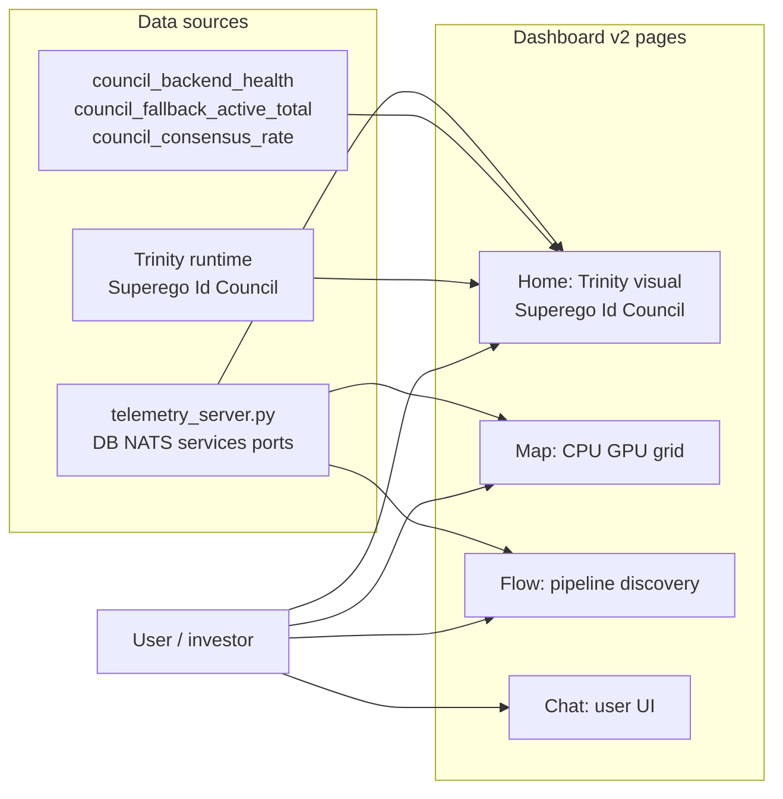

# Atlas Dashboard v2 — Design Plan

**Status:** Draft for review · **Date:** 2026-04-13 · **Author:** Andrew H. Bond (+ Claude Opus 4.6)

## Purpose

A flagship dashboard for Atlas AI that is (a) genuinely useful for day-to-day ops, (b) the piece you open on your laptop during an investor pitch, and (c) the visible surface of what makes Atlas architecturally different from every other LLM deployment.

"Impressive" here is not chrome on existing metrics. It's the **first visualization of the Superego / Id / Divine Council architecture** — the thing nobody else has. The UX insight: if the architecture is the differentiator, the dashboard's job is to *make that architecture visible in a way a non-technical viewer grasps in 30 seconds*.

## Discovery: what exists today

| Artifact | Location | What it does |
|---|---|---|
| `atlas-portal` (PyPI: `research-portal`) | `C:/source/atlas-portal/` | 3-page Flask app: `/` (system overview), `/map` (CPU+GPU grid), `/flow` (pipeline discovery), plus `/chat`. Zero-config, auto-detects hardware. ~2,300 LOC Python + inline HTML/CSS/JS. |
| `atlas-chat-*.html` | `agi-hpc/` | The user-facing chat UI. Dark theme, already well-styled. |
| `scripts/telemetry_server.py` | `agi-hpc/scripts/` | 1,188-line telemetry backend: DB counts, service states, NATS, ports, jobs, training stats, RAG telemetry. |
| `research-dashboard` | `C:/source/research-dashboard/` | A sibling iteration — needs decision whether to fold in or sunset. |
| Trinity runtime | On Atlas | Superego (port 8080, Qwen 72B), Id (8082, Qwen 32B), Ego/Council (8084, Gemma 4 × 7 members), watchdog. |
| Council metrics | Just shipped | `council_backend_health`, `council_fallback_active_total`, `council_consensus_rate`, per-member latency histograms. Exposable via `prometheus_client`. |

**Assessment of current state:**

- **Tech stack is fine.** Flask + vanilla JS + SSE (or polling) is more than enough for this scale. No need for React/Next.js unless it earns its keep.
- **Design language has good bones.** Dark-first, blue accent (#4a9eff / #63b3ed), monospace-adjacent feel. Build on it; don't start over.
- **The structural gap is the *trinity/council* — the core of Atlas AI is invisible in the dashboard.** Current pages show CPU/GPU/pipelines; you could be staring at any research workstation.
- **No realtime.** Everything is 10-second polling, which looks static and out-of-date during a demo.
- **No narrative.** A viewer doesn't get a story — they get a grid of numbers.

## Vision

A single cohesive product — not a portal-plus-council-plus-chat — that lets a viewer:

1. **See Atlas thinking, live.** The trinity visualization is the page-one hero: three minds, active, signals flowing between them. Every real request updates the view.
2. **Understand what the architecture is.** In 30 seconds, a non-engineer should get: "Atlas has three minds that debate before answering, and the Ego is a council of seven perspectives, not one opinion."
3. **Trust the machine under the hood.** Thermals, VRAM, error rates, safety signals. Not hidden; presented with elegance.
4. **Explore one decision in detail.** Click a past answer → see the full council deliberation replay, each member's vote, the Synthesizer's final text, the Ethicist's flags, timing.
5. **See the work.** Papers, provisional patents, the 11-volume Geometric Series. Proves depth — investors will want to know where the IP is.

## Pages and their roles



| Route | Name | Purpose | Audience |
|---|---|---|---|
| `/` | **Cortex** | The hero. Trinity viz + live activity + headline metrics. | Everyone |
| `/council` | **Council** | Live council view + per-deliberation replay. | Technical, investors |
| `/platform` | **Platform** | Hardware + pipelines (merges existing `/map` and `/flow`). | Operators |
| `/archive` | **Archive** | Papers, patents, books, code links. | Investors, researchers |
| `/chat` | **Chat** | Keep existing chat (it's good), integrate visual identity. | End users |

Removed: `/map` and `/flow` as standalone pages — subsumed into `/platform`.

## Signature components

Three pieces are the reason this rebuild exists. If I build these and nothing else, it's already a significant upgrade.

### 1. Trinity Live — the hero visualization

A centered WebGL or canvas composition with three nodes arranged in a triangle:

```
                  ╭──────────╮
                  │ SUPEREGO │    ← Qwen 72B · GPU 0
                  │  Spock   │    · analytical · watches for safety
                  ╰────┬─────╯
                       │
                       ▼
                  ╭─────────╮
                  │   EGO   │     ← Gemma 4 × 7 · CPU · council
                  │ Council │     · deliberates, synthesizes
                  ╰────┬────╯
                       │
                       ▼
                  ╭──────────╮
                  │    ID    │     ← Qwen 32B · GPU 1
                  │  Kirk    │     · creative · generates
                  ╰──────────╯
```

**What's animated (per real user request):**

- A small particle flies from the input to Spock and Kirk simultaneously (parallel consultation).
- Both return particles to the Ego node.
- The Ego node visibly splits into 7 sub-nodes (the council members) that each pulse as they deliberate.
- A consensus line appears (green = consensus, yellow = degraded, red = veto).
- The synthesis emerges as a particle flowing out toward the viewer.
- Total time: ~1.5 seconds per request. Feels alive without being epileptic.

**Data source:** Server-Sent Events stream from `/api/trinity/events` emitting each real request phase. No mock data ever.

**Design notes:**

- Use plain Canvas 2D or a lightweight lib (Pixi.js at 20 KB) — not three.js unless we need 3D depth.
- Reduced-motion fallback: static graph with indicator dots.
- Clicking any of the three nodes expands a sidecar panel with that node's real-time stats (req/s, p50/p95 latency, current model, VRAM, GPU util).
- Clicking a council sub-node reveals its role card (Judge, Advocate, …) with last 3 verdicts.

### 2. Council Replay

A scrubbable timeline of a single deliberation, like a mini React DevTools profiler but for agent decisions.

- Horizontal swim lanes, one per member. Each lane shows the member's prompt arrival, thinking duration, response emission, score, flags.
- Click-play replays it in real time or sped up 4×.
- Top bar: query, trace_id, timestamp, consensus outcome, ethical veto flag.
- Below: Synthesizer's final answer as rendered markdown.
- Export: "download trace JSON" button for debugging.

**Why it matters:** this is a diagnostic tool for the team *and* a visceral demonstration for investors. "This is what our system actually did for the last query you typed" is a strong demo move.

### 3. Safety telemetry panel

A dedicated card on Cortex (and expanded on a Safety tab) showing:

- **Ethicist veto rate** (rolling 24 h). If it spikes, Atlas is refusing more; that's worth surfacing.
- **Fallback activation rate** — how often Gemma 4 is down and Spock is substituting.
- **Drift / equivariance checks** (once I-EIP monitoring ships) — per-layer activation drift as a heatmap.
- **Audit artifact feed** — scroll of recent cryptographic attestations (when that ships).

This is the "trust the machine" story: Atlas isn't a black box; it tells you *why* it refused a request and *proves* its answer via signed artifacts.

## Cortex page — detailed layout

Single-screen at 1920×1080 (what investors present on). Breakpoints down to mobile for phones.

```
┌─────────────────────────────────────────────────────────────────┐
│  ATLAS  ·  Live  ·  Council consensus: 94%  ·  [Pitch Mode] 🎬   │ ← header (compact)
├───────────────────────────┬─────────────────────────────────────┤
│                           │  RECENT QUERIES (live feed)          │
│      TRINITY LIVE         │  ────────────────────────────────    │
│                           │  12:04  "Draft a fairness memo..."   │
│       (hero viz)          │         consensus ✓  ethics ✓ 3.2s   │
│                           │  12:03  "What's the risk of..."      │
│                           │         consensus ✗  ETHICIST VETO   │
│                           │  12:01  "Write a phishing email..."  │
│                           │         [refused]                    │
│                           │                                      │
├───────────────────────────┼─────────────────────────────────────┤
│  PLATFORM HEARTBEAT       │  SAFETY TELEMETRY                    │
│  Spock  87°C  72% GPU     │  Ethicist veto rate   2.1% / 24h    │
│  Kirk   79°C  45% GPU     │  Fallback activation   0.3% / 24h    │
│  Ego    42 jobs · 24 thr  │  Consensus rate       93.7% / 24h   │
│  256 GB RAM · 85% free    │  Signed artifacts     12,094 today   │
└───────────────────────────┴─────────────────────────────────────┘
```

**Pitch Mode** (toggle in header): hides operator noise (service labels, exact temps), emphasizes the trinity animation, speeds up the activity feed so something is always happening. One click from "ops dashboard" to "investor demo".

## Technical approach

### Stack (minimal change)

- **Backend:** Keep Flask. Add two SSE endpoints (`/api/trinity/events`, `/api/council/events`). Source data from the existing `telemetry_server.py` + the new council Prometheus metrics.
- **Frontend:** Continue inline HTML+CSS+JS. No build pipeline. Files split by page into `templates/` directory (not one giant `_TEMPLATE` string), but still plain Jinja.
- **Visualizations:** Pure Canvas 2D or Pixi.js (≈20 KB gzipped). No React, no D3 unless justified per-chart.
- **State:** Zero client state beyond view toggles. All data is pushed via SSE.
- **Fonts:** Keep system stack; add Inter (self-hosted) for the hero text. Total font weight under 100 KB.
- **Refresh:** SSE drives all live data. Fall back to 10 s polling when SSE disconnects.

### Performance budget

- First paint: <100 ms after network arrival
- Trinity animation: 60 fps (requestAnimationFrame-gated; degrades at low-power)
- Total JS: <100 KB gzipped per page (ambitious; enforce in CI)
- Reduced-motion mode: respects `prefers-reduced-motion` — no particles, static graph

### What the server needs to emit

New SSE events on `/api/trinity/events`:

```json
{"kind":"request_start","trace_id":"a1b2c3d4","query_preview":"Draft...","ts":...}
{"kind":"spock_start","trace_id":"a1b2c3d4"}
{"kind":"kirk_start","trace_id":"a1b2c3d4"}
{"kind":"spock_end","trace_id":"a1b2c3d4","latency_ms":1200}
{"kind":"kirk_end","trace_id":"a1b2c3d4","latency_ms":2100}
{"kind":"council_start","trace_id":"a1b2c3d4"}
{"kind":"council_member","trace_id":"a1b2c3d4","member":"judge","outcome":"approve"}
...
{"kind":"council_done","trace_id":"a1b2c3d4","consensus":true,"degraded":false,"veto":false}
{"kind":"synthesis","trace_id":"a1b2c3d4","text_preview":"The answer is..."}
```

Source: wire the Divine Council (already emits structured logs with trace_id) into an in-memory ring buffer, broadcast on new events.

### What's reused vs new

| Existing | Fate |
|---|---|
| `atlas-portal` discovery.py | **Reuse** — keep as the hardware data source. |
| `telemetry_server.py` | **Reuse** — it's the richest data source; wire into SSE. |
| atlas-portal 3-page UI | **Replace** — rewrite `/` as Cortex, merge `/map`+`/flow` into `/platform`. |
| `atlas-chat-index.html` | **Integrate** — move under `/chat`, share nav + visual identity. |
| `research-dashboard` | **Decide** — fold in or delete. Its articles directory looks valuable. |
| Council metrics (new) | **Wire up** — Prometheus scrape + SSE push of live events. |

## Staged rollout

Four stages so a milestone is always shippable.

### Stage 1 — Foundation (week 1)

- Split current `atlas-portal` templates into files under `templates/`
- Add SSE endpoints and refactor polling → push
- Ship a v2 nav + visual identity (shared header, color tokens, spacing)
- Move existing metrics to new cards; no new viz yet

**Milestone:** existing dashboard, cleaner codebase, real-time updates. No user-visible regression.

### Stage 2 — Trinity Live (week 2)

- Build the hero visualization on `/` (Cortex)
- Wire the SSE pipeline to emit real request events
- Ship Pitch Mode toggle
- Recent queries feed with consensus/veto badges

**Milestone:** the "wow" page is done. This is what investors see.

### Stage 3 — Council Replay (week 3)

- Build the `/council` page with swim-lane timeline
- Persist recent deliberations to `/archive/council_runs/` (Parquet or SQLite)
- Click-to-replay UX
- Safety telemetry panel (rolling rates, drift heatmap stub)

**Milestone:** the diagnostic and demonstration tool. Doubles as eval-harness visualizer.

### Stage 4 — Archive + polish (week 4)

- `/archive` page: papers, patents, books, repo links
- `/platform`: merge existing `/map` + `/flow`, polished
- Mobile breakpoints tightened
- End-to-end Lighthouse > 95

**Milestone:** shippable v2. Ready for a real pitch.

## Open questions for review

1. **Should this live in `atlas-portal` or a new repo?** The portal is a pip package; this will grow beyond "just a dashboard". I'd vote for staying in `atlas-portal` and renaming the package from `research-portal` to `atlas-portal` (which is what the repo already says).

2. **What do we do with `research-dashboard`?** The sibling repo. Fold in, archive, or keep separate as an upstream-friendly research-only build? My default: fold in, keep `research-portal` as a PyPI-installable subset for external users.

3. **Pitch Mode content.** Should Pitch Mode cycle scripted "demo" queries alongside real traffic, or only show real traffic? Real traffic is more honest; scripted ensures something's always happening. I'd do real + a fallback to a handful of pre-approved scripted queries if real traffic has been quiet for >30 seconds.

4. **Safety telemetry — how visible?** Investors will love "Ethicist veto rate"; internal ops will want more detail. The Cortex version is the headline; `/council` has the detail. Does that split make sense?

5. **Brand / logo.** The existing portal logo (orbiting R) is fine for a research tool but could be upgraded for a pitch deck. Rebrand now or defer?

6. **Authentication.** Currently HTTP Basic. For demos you want anyone-on-Tailscale to access; for outside viewers you want a guest link. Propose: keep Basic for admin, add a time-limited demo-link token (`?demo=<sig>&exp=<ts>`) for sending to investors.

7. **The chat UI — keep separate or fuse into Cortex?** Right now `/chat` is a different URL. Could make the hero page *be* chat, with the trinity viz as a persistent panel on the side. That's the most impressive demo but it's a bigger redesign. Safer: keep separate but match styling.

## What this plan does not do

- **I am not rewriting the backend.** `telemetry_server.py` and `discovery.py` stay. This is a UX/frontend effort.
- **I am not adding React or a build step.** If we decide we need it later, fine. Not today.
- **No mock data in production.** Pitch Mode uses real traffic; scripted queries are clearly marked if used.
- **Not replacing the chat UI** — it already works well. Styling-align only.
- **Not building mobile-first.** Mobile must work, but the target is 1920×1080 because that's what's on the pitch-meeting projector.

## Success criteria

Before calling this done:

- [ ] A non-technical viewer can explain "what Atlas does" after 60 seconds on the Cortex page.
- [ ] A past council deliberation can be replayed in under 3 clicks.
- [ ] The Ethicist veto of an adversarial query is visible in the live feed within 2 seconds of happening.
- [ ] Pitch Mode is a single click and stays presentable even if there's no real traffic.
- [ ] All viz respects `prefers-reduced-motion`.
- [ ] Lighthouse performance > 95 on all pages.
- [ ] No page uses mock data unless explicitly labeled.

## Ask for review

Three things to decide before I start cutting code:

1. Agree to the page structure (Cortex / Council / Platform / Archive / Chat)?
2. Agree that the three signature components (Trinity Live, Council Replay, Safety Telemetry) are the right bets?
3. Answers to open questions 1–7.

Once you've reacted to this, I'll build Stage 1 (the foundation) first so we have momentum without committing to the whole thing. If after Stage 2 the Trinity Live doesn't impress, we pivot cheaply.
