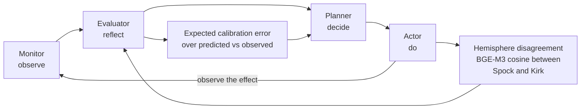

# Phase 7: Closing the Metacognitive Loop

The most critical missing piece. Without this, Atlas is reactive. With it, Atlas genuinely
self-improves. Based on arxiv 2506.05109 (Intrinsic Metacognitive Learning) and our novel
hemisphere disagreement signal.

## The Closed Loop

## 7.1 Hemisphere Disagreement Metric (Novel Contribution)

**Implementation: src/agi/metacognition/disagreement.py**

In every debate round, measure semantic distance between Spock and Kirk:
- Embed both responses with BGE-M3
- Compute cosine similarity
- High similarity (>0.85) = agreement = high confidence
- Low similarity (<0.5) = disagreement = low confidence = flag for user

Track a calibration curve:
- Record (predicted_confidence, was_user_satisfied) per interaction
- Plot expected calibration error (ECE)
- Well-calibrated: when it says 80% confident, correct 80% of the time

Publish to: `agi.meta.monitor.confidence`

## 7.2 Adaptive Routing (Adjuster Closes the Loop)

**Implementation: src/agi/metacognition/adaptive_router.py**

The Adjuster subscribes to confidence metrics and MODIFIES behavior:

1. **Temperature adaptation**:
   - High confidence on topic X -> lower temperature (more precise)
   - Low confidence on topic X -> higher temperature (more exploration)
   - Per-topic temperature in procedural memory

2. **Hemisphere bias**:
   - Track which hemisphere is more accurate per topic domain
   - "Ethics: Kirk scores 15% higher" -> route ethics to Kirk first
   - Updated after every evaluated interaction

3. **RAG strategy selection**:
   - Track which retrieval method works best per query type
   - "Code: BM25 better", "Philosophy: HyDE dramatically improves"
   - Stored in procedural memory

4. **Safety threshold tuning**:
   - Veto rate >10% on topic -> relax slightly (over-cautious)
   - User corrects a safety miss -> tighten threshold
   - Never below hard minimum (reflex layer immutable)

## 7.3 Self-Directed Curriculum Planning

**Implementation: src/agi/metacognition/curriculum_planner.py**

Metacognition drives the AtlasGym curriculum:

1. **Gap detection**: Compare query topics vs training performance
   - "Users ask about quantum mechanics but I score 32% on physics"
   - -> Schedule physics training, queue physics textbooks for RAG

2. **Skill decay detection**: Performance over time per domain
   - "Ethics scores dropped from 85% to 70% this week"
   - -> Schedule ethics refresher, check corpus integrity

3. **Transfer learning detection**: Cross-domain improvements
   - "Greek philosophy training improved modern ethics scores"
   - -> Schedule more cross-domain training, store the relationship

## 7.4 Reflective Memory Integration

**Implementation: src/agi/metacognition/reflective_memory.py**

Reflections become actionable:

1. After N interactions, Reflector generates a reflection
2. Parse for ACTION ITEMS (not just observations)
3. Convert to procedural memory entries:
   - "Better answers when citing files -> always include citations"
   - "Kirk confused users on technical questions -> route pure technical to Spock"
4. Procedures loaded into routing/temperature/RAG decisions

## 7.5 Self-Modification Safety

**Critical: metacognitive loop must be safety-gated**

Safety Gateway evaluates every proposed self-modification:
- "Lower safety threshold" -> vetoed if below minimum
- "Download new training data" -> Safety checks the source
- "Change system prompt" -> Strategic layer reviews

Prevents: reward hacking, safety degradation, runaway self-modification.
DEME Strategic layer with full decision proofs on all self-modifications.

## 7.6 Confidence Display in UI

Show confidence to the user:
- Confidence bar next to each response (green/yellow/red)
- "Atlas is 92% confident" vs "Atlas is 45% confident -- consider verifying"
- High hemisphere disagreement -> show both perspectives explicitly
- Calibration curve in dashboard

## 7.7 Implementation Sequence

| Step | Component | Depends On | Effort |
|------|-----------|-----------|--------|
| 7.1 | Disagreement metric | Both hemispheres | 1 day |
| 7.2a | Temperature adaptation | 7.1 + procedural memory | 1 day |
| 7.2b | Hemisphere bias tracking | 7.1 + evaluation data | 1 day |
| 7.3 | Curriculum planner | AtlasGym + 7.1 | 2 days |
| 7.4 | Reflective memory | Reflector + procedural memory | 1 day |
| 7.5 | Self-modification safety | Safety Gateway + 7.2 | 1 day |
| 7.6 | Confidence UI | 7.1 + chat UI | 0.5 day |
| 7.7 | End-to-end integration | All above | 2 days |

Total: ~10 days for the full closed loop.

## 7.8 Success Criteria

The metacognitive loop is working when:
1. Calibration curve improves over time (ECE decreases)
2. AtlasGym scores trend upward without manual intervention
3. Routing decisions adapt to user behavior
4. Temperature settings diverge per topic (not one-size-fits-all)
5. Atlas can answer "What have you learned this week?" with specific examples
6. Safety thresholds stay within bounds despite self-modification pressure

## 7.9 Novel Research Contributions

1. **Hemisphere disagreement as confidence calibration** -- no prior work uses multi-model
   divergence for metacognitive uncertainty estimation
2. **Cross-civilizational ethical grounding** -- safety decisions informed by 3,300 years
   of moral reasoning across 7 traditions
3. **Self-modifying AGI with formal safety proofs** -- every self-modification passes
   through DEME pipeline with SHA-256 hash-chained audit trail
4. **Hardware-mapped cognitive architecture** -- actual physical memory hierarchy
   (VRAM -> RAM -> SSD -> HDD -> Network) mapped to cognitive tiers
