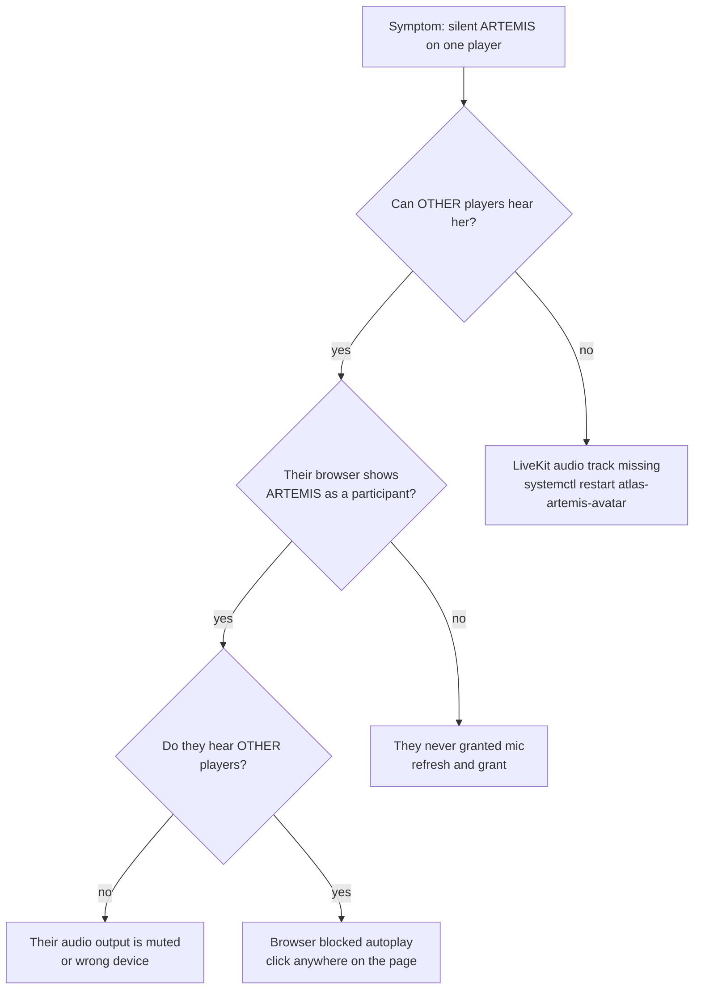

# ARTEMIS Session Runbook

How to run a live Call of Cthulhu session with ARTEMIS as the in-fiction AI NPC on Atlas.

For the system overview, see [`docs/ARTEMIS.md`](../ARTEMIS.md). For the
per-sprint implementation history, [`docs/ARTEMIS_SPRINT_PLAN.md`](../ARTEMIS_SPRINT_PLAN.md).

---

## What you need before a session

**Operator (Keeper) side:**

- Atlas reachable. Any of:
  - LAN — `192.168.0.7`
  - duckdns — `atlas-sjsu.duckdns.org`
  - Tailscale — `100.68.134.21`
- Browser with mic permission for the LiveKit page (Chrome/Edge/Firefox all fine).
- Keeper JWT — minted with `/home/claude/Fuller/artemis-tokens/mint_keeper.py`
  (or whatever the current mint script is named). Identity must start with
  `keeper:`.
- Player tokens — one per seat, minted the same way with `player:<id>`
  identities matching pregen ids (`imogen`, `sully`, `asta`, `arlo`, `saoirse`).

**Player side:**

- Modern browser on desktop or phone. Optional for phone: the chat PWA at
  `https://atlas-sjsu.duckdns.org/chat/` once S1f lands.
- Headset w/ mic. Bluetooth works; wired is better for lag.
- Pre-read the Session 0 briefing PDF (`session0_briefing.pdf`) and their
  chosen pregen PDF (`pregen_<id>.pdf`).

---

## Services that must be running

All systemd, all on Atlas:

| Unit | What it does | Fails if … |
|---|---|---|
| `atlas-nats.service` | Event fabric. Everything else depends on it. | Event traffic stops everywhere. |
| `atlas-caddy.service` | TLS + reverse proxy for `/table/*`, `/livekit/*`, `/api/*`, `/gm/*`. | Browsers can't reach ARTEMIS. |
| `atlas-artemis.service` | Offline `handle_turn` loop — the brain. | No ARTEMIS replies. |
| `atlas-artemis-avatar.service` | Joins LiveKit, publishes HUD video + TTS audio, runs direct-say + chat + sheet bridges. | Avatar not in the meeting. |
| `atlas-artemis-tts-worker.service` | XTTS-v2 burst worker. CUDA/Volta-specific pin (torch 2.6 + cu124). | Avatar falls back to Piper (audible quality drop). |
| `atlas-artemis-chat.service` | SQLite+FTS chat transcript + NATS routing. | Chat card on the table + keeper whispers stop working. |
| `atlas-artemis-portal.service` | GM portal HTTP + scene/sheet/narration/whisper/wiki. | `/gm/` loads but the buttons all 502. |
| `atlas-artemis-sheets.service` (when a sheet URL is set) | Polls the Keeper Google Sheet CSV → HUD. | Crew stats frozen at whatever was last cached. |
| `livekit-server` docker container | The meeting SFU itself. | Nobody can join the room. |

Smoke check in one command:

```bash
systemctl is-active \
  atlas-nats atlas-caddy \
  atlas-artemis atlas-artemis-avatar atlas-artemis-tts-worker \
  atlas-artemis-chat atlas-artemis-portal \
  | sort | uniq -c
```

All rows should say `active`. If any are `inactive (dead)`, see the
per-service row below.

---

## 15 minutes before the session starts

1. **SSH into Atlas.** Either via a Tailscale-reachable shell or locally.
2. **Verify all services active** (see smoke check above). Restart any
   that aren't:

   ```bash
   sudo systemctl restart atlas-artemis-avatar atlas-artemis-tts-worker
   ```

   TTS worker takes ~30 s to load XTTS-v2 onto the GPU after restart.
3. **Confirm the reference voice is in place:**

   ```bash
   ls -la /home/claude/artemis-voice-refs/artemis_ref.wav
   ```

   About 774 KB, 17 s. If it's missing, regenerate via the install
   helper (see S1c).
4. **Pick a room name.** Convention: `session-N-<date>`
   (e.g. `session-2-2026-04-25`).
5. **Mint tokens** for the room — one keeper + one per player. Each token is
   a one-click URL:

   ```
   https://atlas-sjsu.duckdns.org/table/?t=<jwt>&room=<room>
   ```

   For Keeper: also mint a portal URL:

   ```
   https://atlas-sjsu.duckdns.org/gm/?t=<jwt>&session=<room>
   ```

   And a narration URL:

   ```
   https://atlas-sjsu.duckdns.org/gm/narrate.html?t=<jwt>
   ```

6. **Email / DM** the per-player URLs to each player. Keep the keeper
   URLs in your own pile.
7. **Open the GM portal in your own browser.** Confirm the CREW panel shows
   the pregens and the CHAT panel is empty. Confirm the SCENE panel says
   what you expect.
8. **Open the table page in a second browser tab (as the keeper)** to
   verify ARTEMIS is already in the room (she should auto-join whichever
   room the avatar service is configured for).

---

## Session start

- Players open their URLs → they land on the table page, grant mic,
  see the crew HUD + chat + artifacts.
- ARTEMIS is already in the LiveKit meeting when they join.
- Let everyone say hello + confirm they can hear ARTEMIS speaking her
  greeting. If a player can't, see **Troubleshooting: audio**.

### Keeper's three-window layout

- **Tab 1 — GM portal** (`/gm/?t=…`) — crew state, chat threads,
  scene controls, wiki search, approval queue.
- **Tab 2 — Narration** (`/gm/narrate.html?t=…`) — type something,
  ARTEMIS says it. Quick-snippet buttons for common beats.
- **Tab 3 — Table** (`/table/?t=…`) — same view the players see; useful
  for spot-checking what they're actually looking at.

### Talking mode checklist

- Players speak: ARTEMIS's canned responder replies on silence gaps
  (≥ 4 s after last active speaker). This is the in-fiction NPC mode.
- Keeper-as-ARTEMIS: type into the narration console; she speaks your
  text in her voice.
- Keeper whispers to one player: GM portal → Chat → pick compose
  "WHISPER", target the player id → only that player sees it in their
  chat card.
- Keeper broadcasts to all: GM portal → Chat → compose "ALL".

---

## Mid-session common tasks

### Change scene / flags

GM portal → SCENE panel → update name + flags → SET + BROADCAST.
Every open table page updates in place. ARTEMIS's next response will
carry the new scene context in its prompt.

### Look up an NPC / location

GM portal → WIKI panel → search box → `→ CHAT` drops the snippet into
the compose field (doesn't send). Edit, pick whisper/broadcast, send.

### Silence ARTEMIS immediately (X-card)

Publish a silence event on NATS:

```bash
nats pub agi.rh.artemis.silence '{"session_id":"<room>","silenced":true}'
```

Or from the GM portal, click the mic icon on the ARTEMIS tile (S1h
keeper panel). She stops speaking until the same event is sent with
`silenced:false`.

### Update a character sheet

Edit the Google Sheet that's bound to the session (whichever URL
`ARTEMIS_SHEET_URLS` points at). The sheets poller sees the change
within 30 s and emits a NATS diff; HUD updates on every open table.

---

## Troubleshooting

### Audio: a player can't hear ARTEMIS



### Audio: ARTEMIS sounds robotic / choppy to everyone

- **Choppy:** asyncio loop under load. First suspect: the avatar's
  own video render + multiple bridges. Check `journalctl -u
  atlas-artemis-avatar -n 50` for `capture_frame timeout` warnings.
  Restarting the avatar fixes this almost every time.
- **Robotic voice:** TTS backend fell back from XTTS to Piper. Check:

  ```bash
  systemctl is-active atlas-artemis-tts-worker
  journalctl -u atlas-artemis-avatar -n 50 | grep 'TTS backend'
  ```

  Should say `nats_burst` or `xtts`. If it says `piper`, the worker
  died or no heartbeat arrived in the auto-picker probe window.

### Chat: nobody's messages are routing

Chat service must be alive AND the chat NATS subjects must be reachable
from the avatar (which bridges DataChannel ↔ NATS):

```bash
systemctl is-active atlas-artemis-chat
journalctl -u atlas-artemis-avatar -n 50 | grep 'chat bridge'
```

The avatar log should have `chat bridge online: NATS=…`.

### GM portal loads but API calls fail

If the portal HTML loads but buttons 502, the portal service is down:

```bash
sudo systemctl restart atlas-artemis-portal
```

Verify Caddy has the `/api/*` route pointing at `127.0.0.1:8090`. If
recent Caddyfile changes may not have taken effect:

```bash
sudo systemctl reload atlas-caddy
```

---

## Post-session

### Archive the transcript

Chat SQLite lives at `/var/lib/atlas-artemis/chat.sqlite3`.
To export one session's transcript to a zip bundle:

```bash
# TODO S7 — not yet automated
sqlite3 /var/lib/atlas-artemis/chat.sqlite3 \
  "select * from messages where session_id = '<room>';"
```

Once S7 lands, the portal exposes a one-click ZIP.

### Retire the room's tokens

Tokens were minted with 12 h expiry by default, so they age out on
their own. If you want to nuke them sooner (for a session that ran
long and had sensitive context), rotate `LIVEKIT_API_SECRET`
in `/home/claude/.artemis.env` and restart the avatar. All outstanding
tokens become invalid.

---

## Known-safe startup sequence after a reboot

```bash
sudo systemctl start atlas-nats
sudo systemctl start atlas-caddy
sudo systemctl start atlas-artemis         # offline handler
sudo systemctl start atlas-artemis-tts-worker
sleep 30                                    # XTTS load
sudo systemctl start atlas-artemis-avatar  # joins LiveKit after worker is ready
sudo systemctl start atlas-artemis-chat
sudo systemctl start atlas-artemis-portal
# sheets service only if ARTEMIS_SHEET_URLS is set:
# sudo systemctl start atlas-artemis-sheets
```

Everything else is idempotent — rerun in any order after the first boot.
